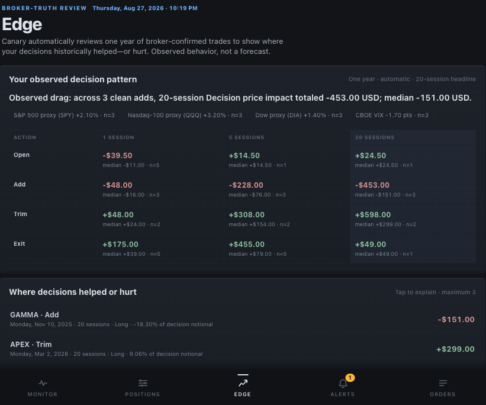

# Canary

[](https://github.com/osauer/canary/actions/workflows/ci.yml)
[](https://github.com/osauer/canary/releases/latest)
[](LICENSE)

**A local risk desk for your Interactive Brokers account.**

Canary turns one local IB Gateway or TWS session into a daily brief, current
portfolio and market evidence, and a broker-confirmed review of what past
position changes delivered. Use the same daemon from an MCP host, the shell,
or a paired phone. The standard binary and every MCP tool are structurally
read-only: they contain no broker-order preview or execution surface.

Canary is for an IBKR Pro user who runs Gateway or TWS locally and wants stale,
missing, or held evidence to remain visible. It is not a hosted brokerage
service, a trade recommender, or a complete TWS API replacement. If you only
need a Go wire-protocol client, use [`pkg/ibkr`](#go-wire-protocol-library).
To read a running Canary from your own Go program, import the module root
`github.com/osauer/canary/v2`: it runs the same read-only tool catalogue over the
daemon socket, and `canarytest` serves the wire types on a temporary socket for
tests.

**[Documentation](https://osauer.dev/canary/docs/)** · [Install](docs/docs/start/install.md) · [First session](docs/docs/start/first-session.md) · [Canary Edge](docs/docs/understand/edge.md) · [MCP tools](docs/docs/reference/mcp-tools.md) · [Safety](SECURITY.md) · [Privacy](PRIVACY.md)

The [v3.9.0 release notes](https://github.com/osauer/canary/releases/tag/v3.9.0)
cover the Go daemon client, the statement performance series, sector allocation
under GICS, and options held as protection listed beside the proposals.

## Start

You need IB Gateway 10.37+ or TWS with API socket access enabled, an IBKR Pro
account, and macOS or Linux on arm64 or amd64. WSL works; native Windows does
not.

For one binary shared by the shell and local MCP hosts:

```sh
curl -fsSL https://raw.githubusercontent.com/osauer/canary/main/install.sh | sh
canary status    # prove which gateway and account Canary reached
canary brief     # review what changed and what needs attention
```

The installer verifies the signed release checksum and installs to
`~/.local/bin`. The [install guide](docs/docs/start/install.md) shows how to
inspect the script first and covers every other installation path. Canary can
discover Gateway or TWS automatically; `canary status` identifies the selected
connection and account. An explicit endpoint pin remains fixed. Market-data
availability depends on your IBKR subscriptions: delayed values stay labeled
and cannot satisfy live-only execution requirements.

For Claude Desktop only, download
[`canary.mcpb`](https://github.com/osauer/canary/releases/latest/download/canary.mcpb),
open it with Claude Desktop, then quit Claude completely and relaunch it. Ask:

> What needs attention today, and which inputs are degraded?

The bundle carries its own macOS and Linux binaries. The
[Claude Desktop walkthrough](https://osauer.dev/canary/claude-desktop-interactive-brokers/)
covers the first connection.



_Current Canary SPA rendered from synthetic data. Edge reports observed
historical outcomes; it is not a forecast or a causal claim._

## Choose your surface

| You want to… | Start with | Boundary |
| --- | --- | --- |
| Ask an agent about the account | The MCP Bundle, or `canary mcp` from any local framework that can launch a stdio MCP server | Read-only tools; no settings writes, previews, or execution tools |
| Work in a terminal or script | `canary brief`, `canary positions --by underlying`, and `--json` | Deterministic CLI output over the same daemon authority |
| Check the desk from a phone | `canary app`, then `canary app pair` | Paired PWA; local by default, optional remote relay |
| Read Canary from your own Go program | `github.com/osauer/canary/v2`, the daemon client, with `canarytest` for tests | The MCP tool catalogue over the daemon socket without an MCP process; the daemon keeps every policy and broker gate |
| Build directly on the TWS protocol | `github.com/osauer/canary/v2/pkg/ibkr` | Lower-level transport; your application owns policy, authorization, and journaling |

Constrained broker actions are not a fifth onboarding path. They require a
separate experimental trading binary and remain limited to gated CLI and
paired-app flows. MCP stays read-only in every build. Read
[Gated orders and the trading build](docs/docs/operate/orders.md) before using
that artifact.

## What Canary helps you answer

- **What needs attention now?** `canary brief`, the Rulebook, and the Action
  Queue combine current alerts, process exceptions, protection candidates,
  and exercise candidates without turning any row into submit authority.
- **Am I within my limits?** `canary rules` checks the book against limits for
  position size, cash reserve, time value, expiry, losses and net market
  exposure. They start from a compiled baseline; `canary rules policy set`
  makes them yours.
- **How is the book exposed?** Account and position reads identify one selected
  account, group stock and option legs by underlying, and keep missing values
  separate from real zeros. Each position carries the listing venue IBKR
  reports. Multi-account ambiguity is refused rather than blended.
- **What did past decisions actually deliver?** Canary Edge uses retained IBKR
  Flex records and exact-contract market history. It reviews account P/L after
  confirmed external flows, compares adequately repeated stock and ETF
  opens/adds/trims/exits with leaving the prior position unchanged over 1, 5,
  and 20 sessions, and reports broker-recorded option P/L separately. It does
  not infer intent, recommend a trade, or claim causation.
- **Can this reading be trusted?** Quotes, calendars, breadth, gamma, regime,
  stress, earnings, borrow, halt, and reporting sources carry their own health,
  freshness, coverage, and last-good state. Unavailable evidence stays
  unavailable. `canary data health --json` reads the service report;
  `canary data check --json` requests a bounded ordinary-quote check. A healthy
  service does not mean every quote is live or suitable for execution.
- **When is the market open, and what is scheduled?** Exchange calendars cover
  US equities and listed options, Xetra, London, Tokyo and Hong Kong, with
  explicit coverage bounds and intraday breaks. `canary macro` separately reads
  cached official economic calendars and publications with their source health.
- **What work already exists?** Proposals, opportunities, and the local order
  journal show what is blocked or ready for human review and how it changed.
  They are evidence, not broker authority. A multi-leg option position is
  reviewed as one unit, net premium paid against net close value at fresh leg
  quotes, and routed to the strategy workflow or a broker combo; the row
  places no order. Option purpose follows the measured book, not per-leg
  declarations.

Reconciliation, statement-derived equity, and Edge require one shared IBKR
Activity Flex Query. Run `canary setup reporting`, then follow the
[screenshot-driven field checklist](docs/docs/start/reporting.md). A received
empty section counts as zero reported activity and does not block readiness.
Missing sections and missing required fields on populated rows remain distinct
problems; `canary reporting status --json` shows the current evidence.

## MCP and agent frameworks

The MCP Bundle is the shortest Claude Desktop path. For another local host,
install the shared binary and point the host at its absolute path. Hosts that
use the common `mcpServers` shape accept:

```json
{
  "mcpServers": {
    "canary": {
      "command": "/ABSOLUTE/PATH/TO/canary",
      "args": ["mcp"]
    }
  }
}
```

Use `which canary` to find the path. A browser-only agent cannot reach this
local stdio process. After upgrading, fully relaunch the host so it respawns
the MCP server.

Continuously running agents can keep this MCP child process available and
reuse Canary's brief, calendar, regime, risk, and order evidence. Use
`canary_calendar` for official exchange sessions, `canary_macro` for official
economic calendars and publications, and `canary_data_health` for passive source
health. Preserve their coverage bounds and original source times. The host owns
durable wakeups, model budgets, and process recovery. Canary owns the observations and risk semantics. See
[continuous hosts](docs/docs/start/hosts.md#continuously-running-agents) for
the lifecycle and data-quality contract.

Ask in desk language rather than naming tools:

> How is my portfolio exposed by underlying?
>
> Which repeated entries, adds, trims, or exits had the largest observed
> 20-session price impact, and what coverage bounds that answer?
>
> Are any protection or exercise candidates ready for human review?

The [host guide](docs/docs/start/hosts.md) covers Claude Code, Cursor, Continue,
Zed, framework integration, logs, and connection checks. The generated
[MCP reference](docs/docs/reference/mcp-tools.md) is the exact tool and schema
inventory. The optional Claude Code plugin adds Canary's skill, MCP config, and
safety hooks; it does not ship the binary.

## Shell and paired app

Every data command supports `--json`:

```sh
canary data health
canary account
canary positions --by underlying
canary brief
canary edge
canary rules
canary regime --explain
canary stress --details
canary technical SPY,QQQ
canary calendar --market us --days 14
canary macro
canary market
canary reporting status
canary proposals list
canary opportunities list
canary orders open
```

For a continuous display, `canary market --watch --json` streams broker updates
with explicit account scope and separate source clocks. One-day charts retain
the last applicable session across weekends and closures; retained bars keep
their actual dates.

Run `canary status` first for connection problems and `canary data health` for
missing or degraded inputs. `canary --help` and the
[CLI reference](docs/docs/reference/cli.md) carry the complete command and flag
inventory.

For the paired app, run `canary app` on the machine that owns the Gateway or
TWS session, then run `canary app pair` and scan the QR code. The current
workspace is Monitor, Positions, Edge, Alerts, and Orders; Settings opens from
the header gear. See the [app guide](web/app/README.md) for local pairing,
remote-relay, and Web Push boundaries.

## Go wire-protocol library

`pkg/ibkr` is a clean-room Go client for the TWS wire protocol:

```go
import (
    "context"
    "time"

    "github.com/osauer/canary/v2/pkg/ibkr"
)

func accountSummary(ctx context.Context, clientID int) (*ibkr.RawAccountSummary, error) {
    cfg := ibkr.DefaultConfig()
    cfg.Port = 4002 // Gateway paper

    connector := ibkr.NewConnector(&ibkr.ConnectorConfig{
        // Use an ID not already owned by Canary or another TWS client.
        PreferredClientID: clientID,
        BaseConfig:        cfg,
    })
    if err := connector.Start(ctx); err != nil {
        return nil, err
    }
    defer connector.Stop()

    return connector.RequestAccountSummary(ctx, 5*time.Second)
}
```

Protocol coverage is purpose-driven, not exhaustive. The package transports
broker requests but does not provide Canary's application-level authority
boundary. Direct users must supply their own policy, authorization, journaling,
and reconciliation controls. Start with the
[package documentation](pkg/ibkr/doc.go).

The public Go module deliberately remains on the maintained `/v2` line while
product v3 ships as signed binaries. Therefore `go install
github.com/osauer/canary/v2/cmd/canary@latest` installs the v2 CLI, not product
v3.

## One authority, several adapters

```text
shell, MCP host, or paired app
              ↓ local Unix socket
         canary daemon
              ↓ local TCP by default
       IB Gateway or TWS
```

The daemon starts on demand, owns the selected account, broker connection,
market evidence, policy state, and local order journal, and normally exits
after 15 idle minutes. Adapters render typed daemon results; they do not
re-create risk policy. Official public-data sources also feed the daemon;
embedded exchange calendars remain available without a broker connection.
The [architecture](docs/docs/internals/architecture.md)
and [storage guide](docs/docs/internals/storage.md) describe the boundaries and
the retained `ibkr` XDG paths used for upgrade continuity.

## Safety and privacy

- **Read-only is the normal product.** The installer, updater, and MCP Bundle
  select the standard binary, whose broker-write handlers are not compiled in.
- **MCP has no preview or execution tools in any build.** It cannot place,
  modify, cancel, submit, or exercise an order.
- **Trading is a separate decision.** The experimental trading artifact keeps
  actions behind a pinned, broker-confirmed account, pinned client ID and trading mode,
  any explicit endpoint pin, a fresh exact review contract,
  broker eligibility where applicable, healthy journaling, daemon
  revalidation, runtime freeze, and transaction-specific human authority.
- **Missing evidence stays missing.** A stale or unavailable input never
  becomes a clean result merely because an older value exists.

Canary has no telemetry and does not send account IDs, balances, quantities, or
P/L to the maintainer. Configured public-data refreshes, an MCP host, remote
relay, or push service receive only the data disclosed in the path you enable.
[PRIVACY.md](PRIVACY.md) is the authoritative data map; [SECURITY.md](SECURITY.md)
covers the threat model and signed release artifacts.

## Help and project information

- [Install and first run](docs/docs/start/install.md)
- [Daily desk workflow](docs/docs/operate/daily-desk.md)
- [Troubleshooting](docs/docs/start/troubleshooting.md)
- [Configuration](docs/docs/reference/config.md)
- [Release and update policy](docs/docs/reference/releases.md)
- [Contributing](CONTRIBUTING.md)

Canary is an independent third-party client for Interactive Brokers' publicly
documented TWS API. It is not built, endorsed, sponsored, or supported by
Interactive Brokers Group, Inc. or its affiliates. `pkg/ibkr` redistributes no
Interactive Brokers code, libraries, jars, or market data. Nothing here is
investment advice.

MIT. See [LICENSE](LICENSE).
