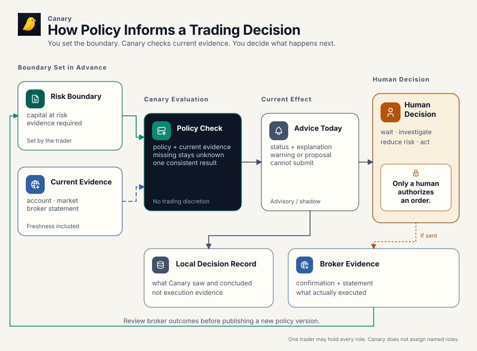
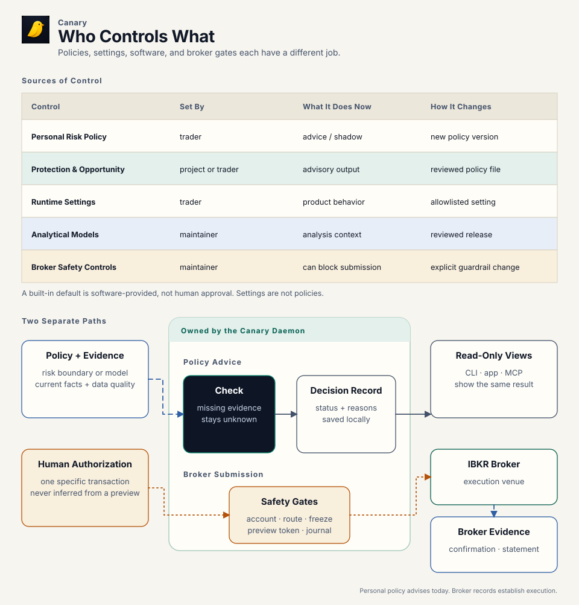

# Trading policy

You decide how much capital may be at risk, which evidence must be current,
and when uncertainty requires attention. Today, `canary`'s personal risk policy
observes, explains, and records those decisions; it does not block or authorize
an order. Every submission remains a transaction-specific human decision and
must pass separate, code-owned safety controls.

A local record explains what `canary` observed and decided. Broker confirmations
and statements establish what actually executed. Missing or unusable evidence
remains unknown rather than being treated as safe.

For one trader, policy is a promise made while calm and applied under pressure.
The same person owns the capital, trades it, and reviews the result, which keeps
the workflow direct without weakening the human submission boundary. The
decision model can inform a family office. The current implementation cannot
become one by assigning the labels to several people: it lacks named principals,
role permissions, maker/checker approval, multi-account and book semantics, and
consolidated reporting. A larger desk needs authenticated identities, scoped
approvals, durable actor records, and a separate control layer before those
responsibilities become system-enforced governance.

## How policy informs a trading decision

[](../../diagrams/policy-lifecycle.svg)

[PNG fallback](../../diagrams/policy-lifecycle.png) ·
[SVG source generator](../../../scripts/render-architecture.mjs) ·
[Tabler Icons license](../../diagrams/ICON-LICENSE.txt)

The human chooses the boundary before the market creates pressure. The daemon
combines that policy with current evidence and returns a structured advisory or
shadow result. The human decides what to do. Outcomes may justify a deliberate
higher policy version, but they never rewrite the active policy by themselves.

> A policy result, proposal, or preview is never permission to submit an
> order.

## Example: a drawdown boundary on stale evidence

Suppose the last accepted equity reading is near a declared drawdown boundary,
but the evidence needed to rely on the current result has become stale. `canary`
must disclose stale or unknown input rather than report a pass. In shadow mode
it can record the condition and show what the declared response would mean; the
personal risk policy still does not change submit eligibility.

The trader decides whether to wait, investigate, reduce risk, or take another
explicitly authorized action. Separate broker-write controls remain binding:
route and account pins, freeze state, preview-token checks, broker
WhatIf/eligibility, journal health, daemon authorization, and origin gating. If
an order is submitted, the broker confirmation and later statement establish
what executed. The local policy record explains the context; it is not
execution evidence.

## Where controls live and who changes them

[](../../diagrams/policy-authority.svg)

[PNG fallback](../../diagrams/policy-authority.png) ·
[SVG source generator](../../../scripts/render-architecture.mjs) ·
[Tabler Icons license](../../diagrams/ICON-LICENSE.txt)

Current evidence is an input, not another policy. The daemon owns evaluation
and publishes one structured interpretation wherever a surface exposes that
decision.

| Source of control | Decision owner and source of record | If absent | Effect today | How it changes |
|---|---|---|---|---|
| Personal risk policy | Human-owned `~/.config/ibkr/policies/risk-policy.toml`; called the risk constitution in code and schema. Canary writes a skeleton whose every number is a commented placeholder | Material choices remain `unapproved` | Advisory or shadow capital, drawdown, evidence, reconciliation, cadence, and exception results | Write the numbers you approve and raise `policy_version` |
| Rulebook policy | `~/.config/ibkr/policies/rulebook-policy.toml`, written from Canary's defaults and then yours | Canary writes it again at the next start; the compiled defaults run until then | Every limit and mode behind `canary rules` | `canary rules policy set KEY=VALUE`, or edit the file and raise `policy_version` |
| Protection and opportunity policy | `protection-policy.toml` and `opportunity-policy.toml`, written from Canary's defaults and then yours | Canary writes them again at the next start; the embedded defaults run until then, which is not evidence of human approval | Shapes defensive proposals and option-exercise opportunity detection | Review the file, edit it, and raise `policy_version` |
| Runtime settings | Human-operated typed settings stored by the daemon in `daemon.db` | The reported config or build default remains visible | Controls product features and allowlisted overrides; settings are not policy files | `canary settings set`, Settings UI, or typed API; freeze and trading-limit changes remain human-only |
| Analytical models | Reviewed code and typed contracts | Present in the installed binary | Calculates Rulebook, Regime, Stress, and related results | Reviewed code and release change |
| Broker safety controls | Explicit human transaction decision plus non-overridable daemon/code checks | The path stays unavailable | Can block a broker write; cannot be weakened by policy or settings | Exact human decision plus reviewed guardrail change where applicable |

MCP exposes read-only research surfaces, never broker-write tools. An agent may
use the gated CLI only after an explicit transaction-specific instruction from
the user in that turn. Apps and dashboards render daemon results; they do not
create policy or submission authority.

## How policy versions behave

Within one running daemon, policy managers apply these rules:

1. A valid first file or a valid higher `policy_version` is accepted.
2. Identical content at the accepted version continues unchanged.
3. Different content at the same or a lower version reports drift and keeps the
   last accepted in-memory version.
4. Invalid syntax, unknown keys, or failed validation report an error and keep
   the last accepted in-memory version where one exists.
5. Removing an active personal risk-policy file reports `absent`; deletion is
   not a retirement command.
6. A protection or opportunity file that failed at startup is accepted at any
   version once it reads again, so a repair is never held back as drift.

A drifted or unreadable file never blocks an exit, a trim or a read. The
protection policy in force keeps generating reduce-only proposals, which stay
previewable and submittable by hand; only pre-authorised submission pauses
(`automation_paused` in the policy status) until the file reads again. The
opportunity list keeps being computed under the policy in force, while
option-exercise preview and submit stay blocked until the file is fixed,
because an exercise is not an exit or a trim.

Restart is a boundary. Accepted policy heads and exact policy content are not
currently persisted as durable policy artifacts. A new daemon starts with no
in-memory accepted version. A valid same-version file changed while the daemon
was stopped can therefore be accepted on startup. A policy file that is absent
at startup is written from Canary's template before the engines read it; only
a file that cannot be written leaves the embedded default in force.

Drift detection is consequently runtime-local today. Always raise the version
for a material edit and retain the exact applied TOML outside `canary`. The
daemon's status tells you what it currently loaded; the human-owned TOML
remains the policy source.

A content fingerprint is a deterministic ID of the normalized policy fields.
It supports semantic equality checks; comments and formatting do not affect
it. It does not reconstruct historical policy by itself: current durable
events retain policy identity, version, and fingerprint, not the complete
normalized policy body. Historical replay therefore also requires the exact
archived policy content.

## Policy files Canary writes for you

Canary keeps a complete file for every policy it reads, so the limits that run
are always ones you can open and read, never values compiled into the binary.
The installer runs `canary policy ensure`, and the daemon runs the same step
each time it starts:

- **A missing file is written** from Canary's defaults: `rulebook-policy.toml`,
  `protection-policy.toml`, `opportunity-policy.toml` and `risk-policy.toml`
  under `~/.config/ibkr/policies/` (or the paths `[rulebook]`, `[auto_trade]`
  and `[opportunities]` name), owner-only. Each opens with the line
  `# Canary defaults, not yet reviewed.` and every surface reports it as
  `default, unreviewed` until you delete that line. `canary policy default
  NAME` prints the same file.
- **Your numbers stay yours.** Canary writes no value for anything only you can
  decide: the constitution's capital numbers, the premium budget governor's
  caps as a share of risk capital, the buckets that may submit automatically
  (`pre_authorised`), and automatic release of a latched drawdown brake. Each
  appears as a commented placeholder, and its feature stays off and says it
  needs your number, one feature at a time; nothing else waits on it.
- **An existing file is never overwritten.** An upgrade migrates it in place:
  it keeps a backup (`<file>.bak-<release>-<time>`), adds each new key at
  Canary's default with a comment naming the release, comments out each
  retired key with where its concept went, and never changes a value you set.
  The policy in force does not change, so no `policy_version` bump is needed
  and no drift is reported. When Canary's recommendation for a key you set
  has changed, the step says `Canary now recommends X; yours is Y` and leaves
  your value alone.
- **A broken file is left alone.** A file that does not parse is neither
  replaced nor migrated; the policy in force stays and the problem is named. An
  absent or broken file never blocks an exit, a trim or a read.

Preview what the step would do, or run it without a daemon:

```sh
canary policy ensure --dry-run
canary policy ensure
canary policy show --explain
```

`canary policy show` lists every policy file with its status and what waits for
your number; `--explain` adds each file's notes: keys it lacks, retired keys,
pending migrations and recommendations.

## Configure the available controls

### Personal risk policy

The personal risk policy has no embedded default and no path override. The
skeleton Canary writes (`canary policy default constitution` prints it) carries
every material numerical choice commented out, so software cannot invent
them.

Its main sections cover capital and the protected floor, drawdown response,
bounded human exceptions, statement reconciliation, operating cadence, and
approved sibling model identities. Schema version 1 accepts `advisory` and
`shadow`; it rejects hard drawdown enforcement. Effective risk capital is the
lesser of declared risk capital and equity above the protected floor.

Inspect the current result with:

```sh
canary policy show
canary policy show --explain
canary policy show --json
```

`--explain` shows units, effective values, input health, drawdown state,
reconciliation, active exceptions, cadence, referenced model identities, and
the current content fingerprint. Mutating governance commands under
`canary policy` are human-only actions, not agent configuration shortcuts.

### Protection and opportunity policies

Canary writes both files from its conservative defaults. Review each one,
delete its `not yet reviewed` line, and raise `policy_version` with every edit.
To compare yours with Canary's current recommendation:

```sh
canary policy default protection
canary policy default opportunity
```

The default paths and every editable key are in the
[configuration reference](../reference/config.md). A proposal or opportunity
remains evidence for a human decision. `authority.auto_submit` must remain
false.

### Runtime settings

Settings control live product behavior; they do not create a new policy rule:

```sh
canary settings show
canary settings show --json
canary settings set <key>=<value>
canary settings set <key>=null
```

`null` removes an override and exposes the underlying config or build default.
Every typed setting reports its source and whether it is writable. No setting
can bypass the non-overridable broker controls. See
[Platform Settings](../../../internal-docs/design/platform-settings.md) for the ownership contract.

## Read status and commissioning correctly

These words describe different facts:

| State | Meaning |
|---|---|
| Human-approved | A person with the desk's decision responsibility accepted the choice. Structural validity or an embedded default does not prove this. |
| Valid | The file matches its schema and internal rules. |
| Active | The running daemon is using that version now. |
| Commissioned | The complete evidence, evaluator, reporting, and operator path has been proven for its intended use. |
| Enforced | The result actually constrains a path. The personal risk policy is advisory/shadow today; separate broker controls are enforced. |
| Delivered | A result reached its intended surface or alert channel. An evaluator can be active while delivery is inactive. |

Do not infer enforcement or delivery merely because a schema, evaluator, or UI
label exists. Typed status is operational evidence about what the daemon has
loaded, evaluated, or commissioned; it is not the source of human policy.
Missing, stale, partial, or contradictory required evidence is an explicit
unknown or data-quality state, never an implicit zero or pass.

## Change a policy safely

For a material policy-file change:

1. Read the current typed status and retain the exact current file, version,
   and fingerprint.
2. Change only values the human decision owner has approved.
3. Raise `policy_version`; never reuse a version for different content.
4. Wait for reload or use the normal operator restart path.
5. Re-read status and confirm the expected source, active version, fingerprint,
   effective values, input health, and absence of drift or error.
6. Exercise the affected read or preview path. A new enforcement rule needs
   replay or shadow evidence and a separate explicit promotion decision.

For a setting, inspect its access and source, change one allowlisted key, and
read it back. For a code-owned model or safety control, use a reviewed release
change. Routine clean cases should be automated; only exceptions should return
to the human.

## Policy terms and references

The [Glossary](glossary.md) defines the vocabulary this page shares with the
rest of the handbook: advisory, shadow, unapproved, submit authority, content
fingerprint, freshness and finality, and the local decision record against
broker execution evidence.

Detailed references:

- [Configuration Reference](../reference/config.md): every configuration,
  advisory-policy, runtime-setting, and environment key.
- [Risk Constitution Design](../../../internal-docs/design/risk-policy.md): capital,
  reconciliation, safety invariants, and implementation history.
- [Trading Rulebook](../../../internal-docs/design/trading-rulebook.md): compiled discipline checks.
- [Trading Harness Development](../../../internal-docs/guides/trading-harness-development.md): how to
  design, shadow, promote, and reconcile a new control.
- [Architecture](../internals/architecture.md): daemon, RPC, adapter, and broker ownership.
- [Sensors](sensors.md): what current evidence means, when it expires, and how
  dependent decisions fail closed.
- [Storage](../internals/storage.md): how applied policy state and local events are stored
  without making SQLite the policy-authoring surface.
