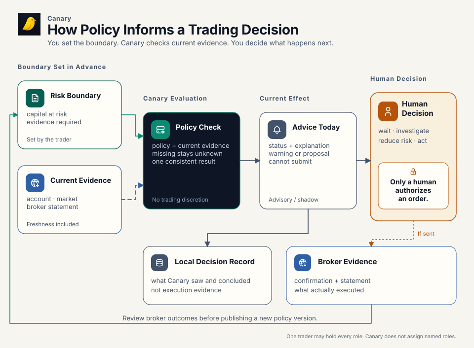
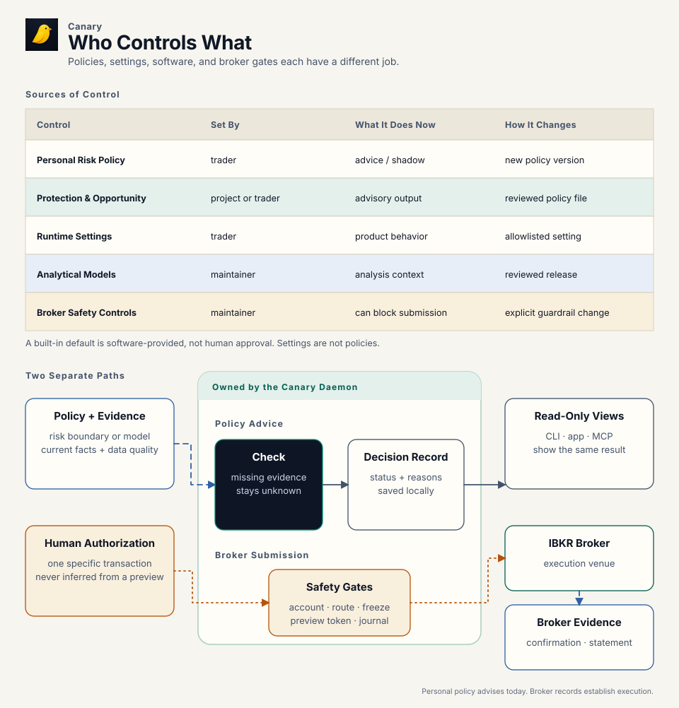

# Trading policy

You decide how much capital may be at risk, which evidence must be current,
and when uncertainty requires attention. Today, `canary`'s personal risk policy
observes, explains, and records the capital decisions. One table in it blocks:
`[order_limits]`, the per-order limits every order preview and broker send must
pass ([Order limits](#order-limits)). Nothing in the policy authorizes an
order. Every submission remains a transaction-specific human decision and must
pass separate, code-owned safety controls.

A local record explains what `canary` observed and decided. Broker confirmations
and statements establish what actually executed. Missing or unusable evidence
remains unknown rather than being treated as safe.

For one trader, policy is a promise made while calm and applied under pressure.
The same person owns the capital, trades it, and reviews the result, which keeps
the workflow direct without weakening the human submission boundary. The
decision model can inform a family office. The current implementation cannot
become one by assigning the labels to several people: it lacks named principals,
role permissions, maker/checker approval, multi-account and book semantics, and
consolidated reporting. A larger desk needs authenticated identities, scoped
approvals, durable actor records, and a separate control layer before those
responsibilities become system-enforced governance.

## How policy informs a trading decision

[](../../diagrams/policy-lifecycle.svg)

[PNG fallback](../../diagrams/policy-lifecycle.png) ·
[SVG source generator](../../../scripts/render-architecture.mjs) ·
[Tabler Icons license](../../diagrams/ICON-LICENSE.txt)

The human chooses the boundary before the market creates pressure. The daemon
combines that policy with current evidence and returns a structured advisory or
shadow result. The human decides what to do. Outcomes may justify a deliberate
higher policy version, but they never rewrite the active policy by themselves.

> A policy result, proposal, or preview is never permission to submit an
> order.

## Example: a drawdown boundary on stale evidence

Suppose the last accepted equity reading is near a declared drawdown boundary,
but the evidence needed to rely on the current result has become stale. `canary`
must disclose stale or unknown input rather than report a pass. In shadow mode
it can record the condition and show what the declared response would mean; the
personal risk policy still does not change submit eligibility.

The trader decides whether to wait, investigate, reduce risk, or take another
explicitly authorized action. Separate broker-write controls remain binding:
route and account pins, freeze state, preview-token checks, broker
WhatIf/eligibility, journal health, daemon authorization, and origin gating. If
an order is submitted, the broker confirmation and later statement establish
what executed. The local policy record explains the context; it is not
execution evidence.

## Where controls live and who changes them

[](../../diagrams/policy-authority.svg)

[PNG fallback](../../diagrams/policy-authority.png) ·
[SVG source generator](../../../scripts/render-architecture.mjs) ·
[Tabler Icons license](../../diagrams/ICON-LICENSE.txt)

Current evidence is an input, not another policy. The daemon owns evaluation
and publishes one structured interpretation wherever a surface exposes that
decision.

| Source of control | Decision owner and source of record | If absent | Effect today | How it changes |
|---|---|---|---|---|
| Personal risk policy | Human-owned `~/.config/ibkr/policies/risk-policy.toml`; called the risk constitution in code and schema. Canary writes a skeleton whose every capital number is a commented placeholder and whose `[order_limits]` carries today's per-order limits | Capital choices remain `unapproved`; without a complete `[order_limits]` every order preview is refused | Advisory or shadow capital, drawdown, evidence, reconciliation, cadence, and exception results; `[order_limits]` is a pre-trade hard gate | Write the numbers you approve and raise `policy_version`; one-shot `canary policy override` for a bounded exception |
| Rulebook policy | `~/.config/ibkr/policies/rulebook-policy.toml`, written from Canary's defaults and then yours | A running daemon retains its last loaded policy and reports drift. With no accepted file at startup, compiled defaults apply and the missing template is written | Every limit and mode behind `canary rules` | `canary rules policy set KEY=VALUE`, or edit the file and raise `policy_version` |
| Protection and opportunity policy | `protection-policy.toml` and `opportunity-policy.toml`, written from Canary's defaults and then yours | A running daemon retains its last loaded policy and reports drift; protection pre-authorised submission pauses. Startup writes missing templates from embedded defaults, which is not evidence of human approval | Shapes defensive proposals and option-exercise opportunity detection | Review the file, edit it, and raise `policy_version` |
| Runtime settings | Human-operated typed settings stored by the daemon in `daemon.db` | The reported config or build default remains visible | Controls product features and allowlisted overrides; settings are not policy files and carry no order limit | `canary settings set`, Settings UI, or typed API; freeze changes remain human-only |
| Analytical models | Reviewed code and typed contracts | Present in the installed binary | Calculates Rulebook, Regime, Stress, and related results | Reviewed code and release change |
| Broker safety controls | Explicit human transaction decision plus non-overridable daemon/code checks | The path stays unavailable | Can block a broker write; cannot be weakened by policy or settings | Exact human decision plus reviewed guardrail change where applicable |

MCP exposes read-only research surfaces, never broker-write tools. An agent may
use the gated CLI only after an explicit transaction-specific instruction from
the user in that turn. Apps and dashboards render daemon results; they do not
create policy or submission authority.

## How policy versions behave

Within one running daemon, policy managers apply these rules:

1. A valid first file or a valid higher `policy_version` is accepted.
2. Identical content at the accepted version continues unchanged.
3. Different content at the same or a lower version reports drift and keeps the
   last accepted in-memory version.
4. Invalid syntax, unknown keys, or failed validation report an error and keep
   the last accepted in-memory version where one exists.
5. Removing an active personal risk-policy file reports `absent`; deletion is
   not a retirement command.
6. A protection or opportunity file that failed at startup is accepted at any
   version once it reads again, so a repair is never held back as drift.

A drifted or unreadable file never blocks an exit, a trim or a read. The
protection policy in force keeps generating reduce-only proposals, which stay
previewable and submittable by hand; only pre-authorised submission pauses
(`automation_paused` in the policy status) until the file reads again. The
opportunity list keeps being computed under the policy in force, while
option-exercise preview and submit stay blocked until the file is fixed,
because an exercise is not an exit or a trim.

Restart is a boundary. Accepted policy heads and exact policy content are not
currently persisted as durable policy artifacts. A new daemon starts with no
in-memory accepted version. A valid same-version file changed while the daemon
was stopped can therefore be accepted on startup. A policy file that is absent
at startup is written from Canary's template before the engines read it; only
a file that cannot be written leaves the embedded default in force.

Drift detection is consequently runtime-local today. Always raise the version
for a material edit and retain the exact applied TOML outside `canary`. The
daemon's status tells you what it currently loaded; the human-owned TOML
remains the policy source.

A content fingerprint is a deterministic ID of the normalized policy fields.
It supports semantic equality checks; comments and formatting do not affect
it. It does not reconstruct historical policy by itself: current durable
events retain policy identity, version, and fingerprint, not the complete
normalized policy body. Historical replay therefore also requires the exact
archived policy content.

## Policy files Canary writes for you

Canary creates a documented file for each missing policy. Legacy partial files
remain readable; omitted rulebook settings still use the documented defaults.
The installer runs `canary policy ensure`, which writes missing files, and the
daemon runs the same step each time it starts, which also migrates existing
files:

- **A missing file is written** from Canary's defaults: `rulebook-policy.toml`,
  `protection-policy.toml`, `opportunity-policy.toml` and `risk-policy.toml`
  under `~/.config/ibkr/policies/` (or the paths `[rulebook]`, `[auto_trade]`
  and `[opportunities]` name), owner-only. Each opens with the line
  `# Canary defaults, not yet reviewed.` and every surface reports it as
  `default, unreviewed` until you delete that line. `canary policy default
  NAME` prints the same file.
- **Your numbers stay yours.** A new file carries no value for anything only
  you can decide: the constitution's capital numbers, the premium budget governor's
  caps as a share of risk capital, the buckets that may submit automatically
  (`pre_authorised`) and automatic release of a latched drawdown brake. Each
  appears as a commented placeholder, and its feature stays off and says it
  needs your number, one feature at a time; nothing else waits on it. The cash
  sweep stays off until you write its table; the daemon then fills any sizing
  number you left out at Canary's default
  ([Reserve and order sizing](../operate/cash.md#reserve-and-order-sizing)).
  A file that still writes the older `[buckets.cash_sweep]` reads the same, and
  the daemon moves it to `[cash.sweep]` without changing a setting
  ([Cash management](../operate/cash.md)).
- **Existing files are migrated in place.** When a release adds keys, the
  daemon keeps the file's original bytes in an owner-only backup
  (`<file>.bak-<release>-<time>`), writes each missing key at Canary's default
  with a comment naming the release, comments out retired keys and logs what it
  changed. It refuses any change to a setting you wrote, apart from raising
  `policy_version` when it writes missing `[order_limits]` keys, cash sweep
  sizing numbers, the `[cash.leveling]` table or `[cash] confirmation_window`, so
  the daemon adopts them.
  Recommendations remain separate owner decisions.
- **A broken file is left alone.** The running manager retains its last good
  settings and reports the file failure. Protection automation pauses when its
  own authority file is uncertain; manual proposals still pass their existing
  execution gates. File review labels and reminder health grant no permission.

Nothing needs running after an upgrade. `canary policy ensure --dry-run` shows
what the next daemon start will change, and `canary policy show --explain`
prints the result afterwards. `--apply-plan FILE` applies only the files of a
saved `--dry-run --json` plan whose hashes still match, ahead of that start; the
plan can contain private settings, so keep it local with owner-only permissions.

`canary policy show` lists every policy file with its status and what waits for
your number, and ends by pointing to the full print. `--explain` adds each
file's notes (keys it lacks, retired keys, pending migrations and
recommendations) and then prints everything that governs behaviour, one
section per source:

- **Risk constitution** (`risk-policy.toml`): every limit with its source and
  enforcement class.
- **Rulebook** (`rulebook-policy.toml`): every limit grouped by rule family,
  the regime-conditional limits as one row per key with a value for each
  regime set (calm, early warning, confirmed), and every rule mode.
- **Protection policy** (`protection-policy.toml`): authority and every
  bucket, including the stock/ETF and option trailing stops, the budget
  governor and the cash sweep with one table per currency (the compiled
  USD, EUR, GBP and CAD declarations print even without a table).
- **Opportunity policy** (`opportunity-policy.toml`).
- **Trading gates** (`config.toml` `[trading]`): the order-entry mode and the
  runtime freeze with the value in force, and each retired order gate the file
  still carries, marked `retired` with the `[order_limits]` key that decides
  instead.
- **Runtime settings**: every `canary settings` value except gateway identity
  and observed market-data quality.

Each key prints its value in force with its unit, its source and its meaning,
taken from the same field descriptions as the
[configuration reference](../reference/config.md). Sources are `file` (the
file sets it), `default` (Canary's default applies), `machine` (Canary
maintains it, such as a bill settlement route, or derives it, such as the
budget governor's caps under `basis = "rulebook"`), `needs your number` (the
feature holds until you write it), `not written` (a cash sweep sizing number
the file lacks, never filled from a default), `unapproved` (a constitution
choice not yet made), `retired` (a key an old file still carries, with no
effect), `in force` (the order cap Canary computes from `[order_limits]` and
the book), and, for settings, `config`, `runtime` or `build`.

`canary policy show SECTION` prints one part in full: `constitution`,
`rulebook`, `protection`, `opportunity`, `trading` or `runtime`, or a table
such as `order_limits`, `cash_sweep`, `trailing_stop`, `budget_reduction`,
`authority` or `regime`.

`--json` carries the same rows under `effective`: `sections[]` (`id`,
`title`, `path`, `identity`, `status`, `review`, `notes`, `groups`),
`groups[]` (`id` is the dotted table, `title`, `columns` for the regime sets,
`notes`, `rows`) and `rows[]` (`key` as the full dotted path, `value`,
`values` per column, `source`, `file_value` for an overridden
`config.toml` value, `enforcement`, `meaning`). `effective.origin` is
`daemon`, or `files` when the CLI read the files because the running daemon
predates this view. With SECTION, `--json` prints only the matching part.

## Configure the available controls

### Personal risk policy

The personal risk policy has no embedded default for capital and no path
override. The skeleton Canary writes (`canary policy default constitution`
prints it) carries every capital choice commented out, so software cannot
invent them; its `[order_limits]` carries values, written from `config.toml`
`[trading]` (see [Order limits](#order-limits)).

Its main sections cover capital and the protected floor, drawdown response,
bounded human exceptions, statement reconciliation, operating cadence, and
approved sibling model identities. Supported schemas accept `advisory` and `shadow`; they reject hard drawdown enforcement. Effective risk capital is the
lesser of declared risk capital and equity above the protected floor.

Inspect the current result with:

```sh
canary policy show
canary policy show --explain
canary policy show --json
```

`--explain` shows units, effective values, input health, drawdown state,
reconciliation, active exceptions, cadence, referenced model identities, and
the current content fingerprint, followed by every other policy and setting
in force. Mutating governance commands under
`canary policy` are human-only actions, not agent configuration shortcuts.

### Order limits

The per-order limits are risk limits and live in the personal risk policy as
`[order_limits]` (owner decision 2026-10-05 19:56 CEST). Until then they were
`config.toml` `[trading]` keys with a runtime override in `canary settings`;
both are retired. The trading gate reads every key from the file only; while
one is missing every order preview is refused with the `order_risk_limit`
blocker naming the key, until the next daemon start writes it. The one
exception is `max_bond_maturity_years`: while it is missing only bond and bill
buys are refused, so it never blocks an exit, a stop or any other order
(owner decision 2026-10-07 08:27 CEST).

| Key | Meaning | `policy ensure` writes |
|---|---|---|
| `max_order_floor_base` | Smallest notional cap in force, account base currency | `[trading].max_notional`, else 10,000 |
| `max_order_pct_nlv` | Share of net liquidation value that sets the cap between floor and ceiling | 10.0 (5.0 before 2026-10-07) |
| `max_order_ceiling_base` | Largest notional cap in force, account base currency | 100,000 |
| `max_option_contracts` | Contracts in one single-leg option order or each strategy-close leg | `[trading].max_option_contracts`, else 10 (5 before 2026-10-07) |
| `allow_stock_short` | A stock or ETF order may open or flip a short | `[trading].allow_stock_short`, else false |
| `allow_option_sell_to_open` | An option order may sell to open | `[trading].allow_option_sell_to_open`, else false |
| `max_bond_maturity_years` | Longest time to maturity, in whole years from today, a bond or bill buy may have (1 to 100) | 30 |

The notional cap scales with the book:

```text
cap in force = min(max_order_ceiling_base, max(max_order_floor_base, max_order_pct_nlv / 100 × NLV))
```

| NLV | Cap in force | Bound by |
|---|---|---|
| 240,000 EUR | 12,000 EUR | 5% of NLV |
| 150,000 EUR | 10,000 EUR | the floor |
| 2,500,000 EUR | 100,000 EUR | the ceiling |
| cannot be read | 10,000 EUR | the floor, flagged |

NLV comes from the last account read for the selected account, in its base
currency, no older than 15 minutes; a preview reads the account again when the
reading is older than 5 minutes. An NLV that cannot be read currently binds the
floor, the smaller cap, and the summary says why. Amounts are in the account
base currency: a `capital.base_currency` that differs from the account's
refuses every order. A refusal names the cap in force and how it was bound, for
example `order notional 15,000 EUR exceeds the order cap in force 12,000 EUR
(5% of NLV 240,000 EUR; [order_limits])`.

Three exemptions stand against the cap in force. A protective stock stop that
sells at most the long position with no competing working sell passes the
notional cap and the short re-read ([Protection](../operate/protection.md)). A
same-currency sweep bill within the sweep's own cap passes the notional cap
when the protection policy writes `bills_exempt_from_trading_max_notional =
true`. And an order that reduces delta passes both the notional cap and the
option cap (owner decision 2026-10-07 08:13 CEST: "tighter order cap must not
block exits if they reduce delta"): it only closes or shrinks a position you
hold, never opening, adding or flipping to the other side, and it lowers the
absolute net delta of its underlying and of your whole book (owner decision
2026-10-07 09:51 CEST: both must fall), measured with the same position
deltas Canary's risk verdicts use (shares at their mark, option contracts at
their delta, multiplier and model spot, all in the account base currency). A
hand exit, an option buy-to-close or sell-to-close, a strategy close, a
reduction proposal or a budget-governor cut above the cap therefore passes
when it lowers both. Closing a long put or buying back a short call that
hedges a long stock raises the stock's absolute delta, so it keeps the cap;
closing index puts that hedge a net-long book, or buying back a short stock
in one, raises the book's, so it keeps the cap too; so does any order while
a line anywhere in your book has a stale quote or no delta, spot or FX rate,
because an unknown delta never exempts (bills, bonds and a defunct zero-value
row count as zero and do not block it; a future, index, CFD, fund or warrant
line, whose delta Canary does not measure, keeps the cap and is named). An
exit that would leave a short
option uncovered keeps the cap as well (owner decision 2026-10-07 09:51 CEST,
on the principle Canary applies to its option combos: never leave a short
leg uncovered): after the order, short calls need long shares or long calls
and short puts need short shares or long puts, and a long option counts as
cover only if it expires on or after the short one (owner decision 2026-10-07
12:28 CEST; a near-dated long in a calendar does not), so selling the stock
under a covered call, the long leg of a spread on its own, or the near leg of
a calendar on its own, is refused with
`this sale would leave 2 short calls on SYNB uncovered, so the order cap
applies`, while a sale that leaves enough shares passes. The order and every
other working order in its direction on the same contract (hand orders in
TWS included, an order Canary itself sent moments ago, and a working combo
close on an option's underlying, which counts against every leg) must
together stay within what you hold, read from the broker's complete
open-order list, so two exits of one line cannot both pass and together flip
it; when that list cannot be read, the cap applies and the refusal says so,
for example `another working order already sells 700 of the 1,000 SYNB
shares you hold; with this one, more would be sold than you hold. Cancel it
first`. The refusal then says why,
for example `order notional 15,000 EUR exceeds the order cap in force 12,000
EUR (5% of NLV 240,000 EUR; [order_limits]); the exit does not lower the
absolute delta of SYNA (110,400 EUR before, 158,400 EUR after), so the cap
applies`. Bills, bonds and conversions carry no equity delta and never
qualify. A pre-authorised protection bucket's option exit passes the same way
without a per-order approval, after its notice and veto window (owner
decision 2026-10-07 12:28 CEST). The short and sell-to-open permissions, the
bond maturity limit and the currency checks have no exemption: a stock exit
above the cap still needs
`allow_stock_short` and an option sell-to-close still needs
`allow_option_sell_to_open`, exactly as below the cap.

The bond maturity limit (owner decision 2026-10-06 20:17 CEST) counts whole
years from today's UTC date: with 30 written, a buy on 2026-10-06 may mature on
or before 2056-10-06, and a bond maturing a day later is refused, for example
`the bond matures 2056-10-07, beyond the 30-year limit in force (2056-10-06;
[order_limits].max_bond_maturity_years)`. A maturity Canary cannot read is
refused too. Selling a bond you hold is never limited by it.

For a time-bounded larger cap, a human grants a one-shot override of the floor:

```sh
canary policy override --control order_limits.max_order_floor_base --reason "..." --hours 4
```

It lifts the floor to the ceiling until it expires (at most
`override.max_duration_hours`), is journaled with the policy fingerprint, and
cannot exceed the ceiling. The other order limits take no override; change
them with a revision. `canary policy show [--explain]`, `canary trading status`,
the settings view (read-only, source `policy`) and the typed `order_limits` of
`trading.status` and `risk_policy.snapshot` all state the cap in force and how
it is bound.

A file written before `[order_limits]` existed gains the table at the next
daemon start, after a backup: each key from `config.toml` `[trading]` (a
10,000 floor, 5 option contracts and no shorting or selling to open where a key
was never set), the two scaled-cap keys, `max_bond_maturity_years = 30` and a
raised `policy_version`. A table written before `max_bond_maturity_years`
existed gains that key alone, 30, the same way. To return
to a fixed cap, set `max_order_ceiling_base` equal to `max_order_floor_base` and
raise `policy_version`. The
`[trading]` keys still load so an old `config.toml` stays valid, are never read
for a decision, print as `retired` in `policy show --explain`, and
`policy check` warns while one remains with a different value.

### Protection and opportunity policies

Canary writes both files from its conservative defaults. Review each one,
delete its `not yet reviewed` line, and raise `policy_version` with every edit.
To compare yours with Canary's current recommendation:

```sh
canary policy default protection
canary policy default opportunity
```

The default paths and every editable key are in the
[configuration reference](../reference/config.md). A proposal or opportunity
remains evidence for a human decision. `authority.auto_submit` must remain
false.

### Runtime settings

Settings control live product behavior; they do not create a new policy rule:

```sh
canary settings show
canary settings show --json
canary settings set <key>=<value>
canary settings set <key>=null
```

`null` removes an override and exposes the underlying config or build default.
Every typed setting reports its source and whether it is writable. No setting
can bypass the non-overridable broker controls. The `trading.limits.*` keys are
retired: the settings view reports the order limits read-only from the policy,
and setting one is refused with a pointer to [Order limits](#order-limits). See
[Platform Settings](../../../internal-docs/design/platform-settings.md) for the ownership contract.

## Read status and commissioning correctly

These words describe different facts:

| State | Meaning |
|---|---|
| Human-approved | A person with the desk's decision responsibility accepted the choice. Structural validity or an embedded default does not prove this. |
| Valid | The file matches its schema and internal rules. |
| Active | The running daemon is using that version now. |
| Commissioned | The complete evidence, evaluator, reporting, and operator path has been proven for its intended use. |
| Enforced | The result actually constrains a path. The personal risk policy is advisory/shadow today except `[order_limits]`, which every order preview and broker send must pass; separate broker controls are enforced. |
| Delivered | A result reached its intended surface or alert channel. An evaluator can be active while delivery is inactive. |

Do not infer enforcement or delivery merely because a schema, evaluator, or UI
label exists. Typed status is operational evidence about what the daemon has
loaded, evaluated, or commissioned; it is not the source of human policy.
Missing, stale, partial, or contradictory required evidence is an explicit
unknown or data-quality state, never an implicit zero or pass.

## Check a policy for plausibility

Canary validates each key against its own range when it loads a file. `canary
policy check` (added 2026-10-05 18:54 CEST) reads the values against each
other, across `config.toml` and the four policy files, and against the live
book, and says what is implausible and what to write instead. It is
read-only: it changes no limit, gate or order.

```text
canary policy check [--offline] [--config PATH] [--json]
```

With a daemon it reads the account (NLV, base currency, cash per currency),
the positions, an active override of the order floor and each policy
manager's status; the order cap in force is sized from the book's NLV, or at
its floor without one, as the gate sizes it. Without one, or with
`--offline`, it runs the file-only checks and lists the book checks it
skipped. Each finding carries a severity, the keys involved with their file
and value, one sentence on what is wrong and why, and a suggested value with
its reasoning. The command exits 1 only when a finding is an error.

| Severity | Meaning |
|---|---|
| error | An order path that can never work, or two limits that contradict each other. |
| warn | Implausible against the book or the economics. |
| info | A value nobody has reviewed: an unreviewed file, a compiled default in force, a date about to end. |

The rules form one catalogue (`internal/daemon/policy_check_rules.go`); a new
rule is one entry.

| Rule | Severity | Needs the book | What it reports |
|---|---|---|---|
| `file_refused` | error | no | Canary's loader refuses a policy file, so the previous policy or Canary's defaults stay in force. |
| `order_limits_missing` | error | no | The constitution does not write every `[order_limits]` key, or there is no constitution, so the trading gate refuses every order preview. |
| `cap_above_trading_max` | error | no | The cash sweep's cap in force (the larger of `max_order_notional` and `max_order_pct_nlv` percent of NLV) lets a bill order exceed the order cap in force (`[order_limits]`), which the gate always refuses. `bills_exempt_from_trading_max_notional = true` makes that gap legitimate. The reduction buckets are reported by `reduction_cap_above_order_cap` instead, because their rows pass the gate as delta-reducing exits. |
| `sweep_minimum_above_cap` | error | no | A sweep currency's smallest buy (`min_order_notional` in base at the currency's rate, raised by a retired `min_tranche` a legacy file still carries) is above the sweep's cap in force, or above the order cap in force without the bill exemption. |
| `watch_act_inverted` | error | no | A watch level beyond its act level in every pair and regime set (the wrong way round for falling measures: margin headroom, expiry runway), a hedge band minimum above its maximum, or the drawdown warn level above block. |
| `regime_loosens_under_stress` | error | no | A budget (premium, time value, net exposure) higher, or a hedge band lower, in a worse regime set than in a calmer one. |
| `order_entry_off_for_active_bucket` | error | no | A bucket (cash sweep, budget governor, currency leveling) is active or pre-authorised while `[trading].mode` disables order entry. |
| `settlement_route_expired` | error | no | A sweep currency's `settlement_valid_through` has passed, so its bill orders hold. |
| `base_currency_mismatch` | error | yes | The constitution's `base_currency` differs from the account's. |
| `lot_above_trading_max` | error | yes | One contract of a held option line is worth more than the order cap in force, and closing one contract would not pass as a delta-reducing exit (it would not lower the underlying's or the book's absolute delta, would leave a short leg uncovered, or a line's delta cannot be measured; the finding names the reason), so no exit for it can pass the gate. A line whose close passes as a delta-reducing exit is exempt from the cap and not reported. |
| `cap_without_fx_headroom` | warn | no | A cap sized in another currency sits within 2% of the order cap in force, so an FX move refuses an order sized at the cap. |
| `sweep_nothing_to_buy` | warn | no | The sweep is enabled while a currency it would invest in has nothing to buy: its first plannable instrument is a bill other than US Treasury bills and no `isins` are listed, so the currency reads `universe_unavailable` and its cash stays cash (the ETF fallback follows a completed search of listed bills, so it never acts on an empty list). A currency declared `none` is kept as cash on purpose and is no gap. |
| `order_cap_vs_nlv` | warn | yes | A per-order cap is under 2% or over 50% of NLV. |
| `order_cap_splits_reduction` | warn | yes | A bucket's cap splits a planned trim (issuer act back to watch, premium budget act back to watch) into more than 5 orders, or the order cap in force splits a whole option-line exit it still binds (one that would not pass as a delta-reducing exit; the finding names the reason) into more than 5. Delta-reducing exits and protective stock stops are exempt from the order cap and are not counted. |
| `cash_reserve_vs_nlv` | warn | yes | The cash the sweep keeps back is under 2% or over 50% of NLV: with the reserve design, the larger of the base currency's `keep_cash` and the reserve (the largest of `reserve_floor_base` and `reserve_pct_nlv` of NLV), plus `keep_cash` in the other currencies; without it, `keep_cash` across the swept currencies. |
| `protected_floor_vs_equity` | warn | yes | The protected floor sits at or above equity, or leaves less than the declared risk capital above it. |
| `declared_risk_vs_nlv` | warn | yes | Declared risk capital is above NLV or under 2% of it. |
| `sweep_buys_while_borrowed` | warn | yes | `no_buy_while_borrowed = false` while a currency's cash is negative by more than 1 unit, so the sweep may buy bills while the account pays margin interest on the debit. |
| `leveling_debit_inside_band` | warn | yes | A currency is borrowed (by more than 1 unit) but within currency leveling's `trigger_base`, so leveling leaves that margin loan in place; with `no_buy_while_borrowed`, the sweep's bill buys wait meanwhile. |
| `sweep_minimum_uneconomic` | warn | no | The smallest bill buy (as for `sweep_minimum_above_cap`) earns less interest over cash to the shortest rung (`min_maturity_days`) than the commission it pays. |
| `retired_trading_gate` | warn | no | `config.toml` `[trading]` still carries a retired order gate whose value differs from the `[order_limits]` key that decides. |
| `version_not_bumped` | warn | daemon | A file changed without a higher `policy_version`, so the daemon keeps the old policy. |
| `dated_assumption_expired` | warn | no | `cash_interest_valid_through` or a directional intent's `expires_at` has passed. |
| `dated_assumption_expiring` | info | no | One of those dates ends within 14 days. |
| `file_unreviewed` | info | no | A file still carries the "Canary defaults, not yet reviewed" header; for the Rulebook it names the limits that already differ from the defaults. |
| `compiled_default_in_force` | info | no | A sweep sizing number is not written, so the sweep holds at `needs_your_number`. |
| `sweep_cap_exempt` | info | no | `bills_exempt_from_trading_max_notional` is declared, and whether the sweep's cap in force uses it. |
| `reduction_cap_above_order_cap` | info | no | A `risk_reduction` or `budget_reduction` cap is above the order cap in force (in the contract currency at the book's FX rate). Its rows pass the gate only as delta-reducing exits; a row that does not lower its underlying's absolute delta, or whose delta cannot be measured, is refused at the order cap. Reported so the condition stays visible. |

The bounds (2% and 50% of NLV, 5 orders, 2% FX headroom, 14 days) are the
check's judgement, not limits; nothing enforces them. No policy or config key
carries a bill yield or a commission, so the economics rule assumes them and
the report lists each assumption: US Treasury bills 3.5% a year and 0.002% of
face with a 5 USD minimum; EUR bills 1.75%, GBP 3.5%, CAD 2.25%, each with a
minimum of 5 in the bill's currency and the percentage fee not modelled. A
written `cash_interest_rate_upper` lowers the yield to the gain over cash, and
`min_net_gain` raises the bar. The same report is the `plausibility` field of
the `policy.snapshot` RPC and the MCP tool `canary_policy_check`.

## Change a policy safely

For a material policy-file change:

1. Read the current typed status and retain the exact current file, version,
   and fingerprint.
2. Change only values the human decision owner has approved.
3. Raise `policy_version`; never reuse a version for different content.
4. Wait for reload or use the normal operator restart path.
5. Re-read status and confirm the expected source, active version, fingerprint,
   effective values, input health, and absence of drift or error.
6. Exercise the affected read or preview path. A new enforcement rule needs
   replay or shadow evidence and a separate explicit promotion decision.

For a setting, inspect its access and source, change one allowlisted key, and
read it back. For a code-owned model or safety control, use a reviewed release
change. Routine clean cases should be automated; only exceptions should return
to the human.

## Policy terms and references

The [Glossary](glossary.md) defines the vocabulary this page shares with the
rest of the handbook: advisory, shadow, unapproved, submit authority, content
fingerprint, freshness and finality, and the local decision record against
broker execution evidence.

Detailed references:

- [Configuration Reference](../reference/config.md): every configuration,
  advisory-policy, runtime-setting, and environment key.
- [Risk Constitution Design](../../../internal-docs/design/risk-policy.md): capital,
  reconciliation, safety invariants, and implementation history.
- [Trading Rulebook](../../../internal-docs/design/trading-rulebook.md): compiled discipline checks.
- [Trading Harness Development](../../../internal-docs/guides/trading-harness-development.md): how to
  design, shadow, promote, and reconcile a new control.
- [Architecture](../internals/architecture.md): daemon, RPC, adapter, and broker ownership.
- [Sensors](sensors.md): what current evidence means, when it expires, and how
  dependent decisions fail closed.
- [Storage](../internals/storage.md): how applied policy state and local events are stored
  without making SQLite the policy-authoring surface.

## Identity, revisions and permission

`kind` identifies the file type. Both `canary.*` and the corresponding legacy
`ibkr.*` names are readable; paths and stable policy IDs do not move.
`schema_version` selects supported semantics. `policy_version` records the
owner's revision and orders material changes within a running daemon.

The constitution's schema 1 preserves historical revisions: 1–2 use declared
flows, 3 enables statement-backed reconciliation, and 4 or later enables the
current process reminders. Schema 2 defines those current semantics regardless
of revision. Converting revisions below 4 would change behaviour, so the
converter leaves them alone. A schema-1 revision 5 needs no conversion to work.

Operational comparison uses effective settings, including stable policy ID and
all real limits, scope and grants. Kind spelling, descriptive profile labels,
revision-only bumps and retired controls do not change that comparison. Original
fingerprints remain in evidence. When the exact old policy and current scoped
inputs reproduce a previous proposal revision, the snapshot retains that public
revision and records its effective counterpart. Existing vetoes, notice windows,
consumed submissions and preparations then remain bound to the same decision,
including after restart. No arbitrary fingerprint aliases are accepted.

An old prepared action without provable identity continuity requires a fresh
preview. An unproven automatic revision follows the existing new-revision notice
and veto-window rules. Deploy the compatible reader before converting files so
unchanged old provenance can establish continuity. No confirmation is reconstructed.

The accepted policy is held in memory. A restart cannot reconstruct the previous
accepted body or enforce the previous process's revision head; backups preserve
converted files, not a durable approval ledger.

Each alert source establishes its own baseline within its account/mode scope.
The first current observation does not push old conditions. Subsequent eligible
occurrences retain receipt deduplication, even when another source is missing or
stale. Overall coverage is diagnostic, not trading permission or proof of phone
delivery. Source ordering, fresh evidence and notification preferences still apply.
