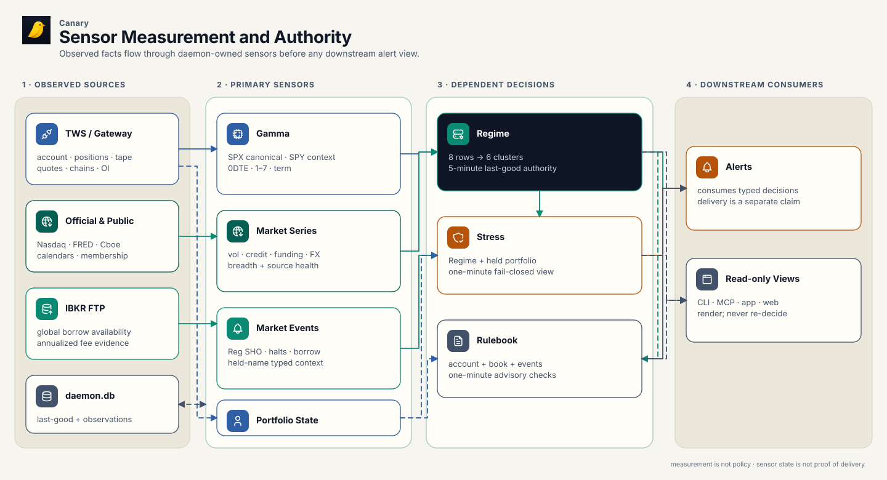
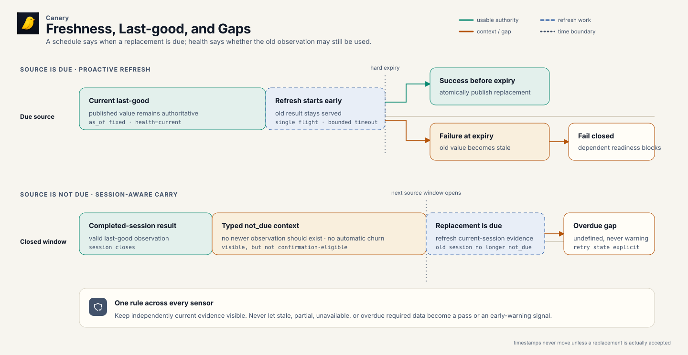

# Sensors

Sensors turn broker and public-source observations into typed measurements with
an `as_of` time, source health, freshness, and a semantic fingerprint. They do
not decide trading policy, authorize an order, or prove that an alert reached a
device.

The daemon is the measurement authority. It owns source access, scheduling,
last-good state, and evaluation. CLI, MCP, app, and web surfaces read the same
typed results without refetching sources or recreating the verdict.

## Dependencies and boundaries

[](../../diagrams/sensor-authority-pipeline.svg)

[PNG fallback](../../diagrams/sensor-authority-pipeline.png) ·
[SVG source generator](../../../scripts/render-architecture.mjs) ·
[Tabler Icons license](../../diagrams/ICON-LICENSE.txt)

Gamma feeds Regime; Regime and market events feed Stress and Rulebook. Alerts
may consume the resulting typed state, but a sensor result is not evidence that
delivery is active or that a notification arrived.

A dependent sensor receives the upstream result with its health and does not
recompute it. Stress uses the exact Regime publication; Rulebook uses the
daemon's classified Regime stage rather than rebuilding one from market rows.

## Read the state before the number

[](../../diagrams/sensor-freshness-timeline.svg)

[PNG fallback](../../diagrams/sensor-freshness-timeline.png) ·
[SVG source generator](../../../scripts/render-architecture.mjs) ·
[Tabler Icons license](../../diagrams/ICON-LICENSE.txt)

Freshness is part of the measurement. The daemon refreshes before a result's
hard expiry where the source permits it. A successful refresh atomically
replaces the last-good publication. A failed refresh leaves the older result
visible with explicit health; it never changes an old value's timestamp or
turns absence into zero.

| State | Meaning | Safe interpretation |
|---|---|---|
| `current` | The source refresh is complete and no newer observation is due. | Use the value subject to its quality and scope. |
| `not_due` | The source's publication or trading window is closed, so no newer observation should exist yet. | Keep valid last-good context visible, but do not promote it to fresh confirmation. |
| `partial` | Some expected fields, symbols, or child sources arrived and others did not. | Use only the explicitly complete part; absence elsewhere is unknown. |
| `stale` | A known value is older than its allowed evidence window or a due refresh failed. | Display as old context; dependent decisions normally degrade or block. |
| `unavailable` | No usable value exists for the requested scope. | Do not infer a neutral, inactive, or passing result. |
| `degraded` | The result exists, but source or model quality limits how it may be used. | Read the blocker and use only the permitted context. |
| `computing` | A background calculation is running and no completed replacement can yet be served. | Wait or poll; progress is not a measurement. |
| `overdue` | The native cadence says a newer observation should already exist. | Treat required evidence as a data-quality failure, not a warning signal. |

`not_due` and `overdue` are opposites: an expected schedule gap against a missed
obligation. `partial` describes coverage and `stale` describes time. One source
can be both incomplete and old at different layers of a result.

## Gamma

### What it answers

Gamma estimates how the aggregate options-dealer book may respond as the
underlying moves, and where gross gamma is concentrated. The signed profile
looks for a zero crossing: below it the modeled book is generally amplifying
moves, above it generally damping them. Read the result as a market-structure
hint. It is not a precise trade level.

SPX/SPXW is the canonical S&P 500 signal; SPY is corroborating ETF context. The
two use different scales, so the default `spy+spx` result keeps separate
per-index price levels and intentionally has no combined top-level spot or
zero-gamma price. It also reports whether the two books agree. A healthy SPX
result stays usable when SPY is throttled or unavailable; SPY-only remains a
labeled proxy when SPX is absent. [Concepts](concepts.md#gamma) has the
methodology behind that reading, the sign convention, and the agreement
classifier's values.

### Inputs and outputs

The daemon qualifies IBKR SPX/SPXW and SPY option contracts, collects option
prices or derives IV, captures open interest, and anchors the sweep to observed
spot. Missing open interest is unknown, never zero. Priced legs can support the
IV/skew fit but do not contribute open-interest-weighted exposure without
observed OI.

Each per-index result reports:

- zero-gamma status, zero-gamma price when a crossing exists, and spot's
  percentage gap from it;
- the full signed profile and the swept spot range;
- separate 0DTE, 1–7 DTE, and term profiles and crossings;
- `gamma_total_abs`, the sign-agnostic gross gamma magnitude, and `top_strikes`,
  the largest absolute concentrations;
- priced and contributing leg counts, OI/IV/skew coverage, warnings, and
  `quality.rankability`.

Only `rankable` may contribute a Regime band or confirm stress. `context_only`
is displayable but does not vote. `blocked` and `unavailable` are not usable
signals. Missing 0DTE is disclosed in horizon coverage and warnings; it alone
does not block a healthy SPX surface with 1–7 DTE and term coverage, because
once the expiring SPXW series closes the 0DTE bucket can be absent while the
broader surface stays usable.

Some Gamma quality bars, skew-fit quality among them, remain heuristic pending
calibration from retained diagnostics. The result exposes the gate and its
reason instead of presenting those bars as proven thresholds.

### Timing and last-good behavior

After the gateway is ready, the daemon prewarms canonical combined Gamma and
checks refresh eligibility every minute. A request with no serveable result
returns `computing` with progress and an ETA for the multi-minute background
compute; concurrent callers for one scope share that work.

During regular US options hours, normally 09:30–16:15 ET on the US options
calendar, a successful result becomes due for refresh after 15 minutes. The
daemon serves last-good while the replacement computes, promotes only a
successful replacement, and backs off repeated failures. Outside those hours,
automatic refresh is suppressed on purpose.

The 15-minute interval triggers a refresh; it does not set the quality ceiling.
Standalone rankability on the direct surface needs a current-session result no
more than 60 minutes old during RTH, or a closed-session cache no more than 24
hours old.

Regime treats that closed-session result differently. The latest
completed-options-session value is typed `not_due` context before the next open
and cannot confirm, then becomes overdue at the open unless a current-session
compute replaces it. No last-good result, a missed completed session, or a due
refresh gap is a data-quality condition.

### Safe check

```sh
canary gamma --json
canary gamma --only spx --json
```

Read `status` first, then `result.quality.rankability`, `as_of`, session keys,
coverage, and `warning_details`. Use `--force` only for an intentional
diagnostic recompute; it is not the normal freshness mechanism.

## Regime

### What it answers

Regime asks whether several independent market channels agree that stress is
developing. Its eight rows draw on live IBKR market data, official public
series, Gamma, and S&P 500 breadth, and group into six clusters.
[Concepts](concepts.md#regime) explains what each row measures. Cluster
independence is what gates confirmation.

| Cluster | Rows |
|---|---|
| Volatility | VIX/VIX3M term structure; VVIX |
| Credit | HYG/SPY divergence; HY/IG option-adjusted spreads |
| Funding | Commercial-paper/T-bill spread |
| FX | USD/JPY weekly move |
| Gamma | SPX-canonical dealer gamma with SPY context |
| Breadth | S&P 500 breadth |

Each row carries measurements, band, reason, source and scalar provenance,
native-cadence freshness, streak, and red-band eligibility. The combined result
reports raw and confirmed cluster counts, source health, posture, a semantic
fingerprint, and one of `quiet`, `early_warning`, `confirmed_stress`, `panic`,
`stabilization`, `opportunity`, or `data_quality`.

Red does not automatically mean confirmed. Depth, persistence, freshness, and
cluster independence decide whether a red row may confirm stress. A provisional
red stays visible and may support `early_warning` only when the required
evidence set is otherwise usable. Missing, broken, contradictory, or overdue
required evidence instead produces `data_quality`, blocked readiness, and the
label `Market state undefined — data incomplete`.

Thresholds and severity governors labeled `heuristic` and `pending_backtest` are
reviewed starting assumptions awaiting point-in-time calibration, not proven
market laws. The result exposes governors so a lower severity beside red rows is
explainable rather than silently rewritten.

### Timing and authority

Regime publishes one immutable, daemon-owned last-good result to `daemon.db`,
with a five-minute operational authority window. A scheduler checks every five
seconds and starts a refresh about one minute before expiry, leaving the full
45-second acquisition budget plus a cushion. A Gamma publication can also wake
Regime. App polling and alert consumers do not own this schedule.

Two slower inputs keep their own publication clocks. Outside VIX3M
dissemination — before it opens as well as after it closes — the frozen VIX term
observation stays visible and reads `not_due` whichever subscription mode the
broker reports for either Cboe index leg; while VVIX is current the volatility
source is healthy and `not_due`, not a stale-source warning. S&P 500
breadth starts after the official equity close plus a 35-minute settlement
delay. A full broker-paced pass can take about 74 minutes, so the prior
last-good is healthy `not_due` context only while a refresh or retry remains
inside the explicit 90-minute publication window, and stale at that deadline
without a current-session result.

Breadth counts only constituent windows whose last bar matches the requested
trading session. Successful windows are checkpointed every ten names, so a
restart resumes near its last completed work instead of repeating the fan-out.
The result exposes refresh start, processed and total names, publication
deadline, and a redacted failure reason. Those fields describe progress; they
never make an incomplete snapshot current.

Only a complete replacement becomes current. During a refresh, consumers see the
prior publication with `refreshing` authority health; a failed refresh keeps
last-good and marks authority stale with the typed failure and retry state. A
cold start with no valid publication is unavailable. Dependent sensors receive
this authority health and must not present a stale publication as current.

### Safe check

```sh
canary status --json
canary regime --json
canary regime --explain
```

Check Regime authority health, `as_of`, lifecycle readiness, each cluster's
`source_health`, row freshness and eligibility, then `governors`. A green row
does not prove the whole result is usable when another required cluster is
overdue.

## Stress

### What it answers

Stress asks whether the current broad-market state is relevant to the portfolio
actually held. It combines four daemon-owned inputs: account, positions, the
exact published Regime result, and market events for held names. It does not
fetch a second market view, and it never treats the portfolio's own losses as
confirmation of a broad market event.

The output separates `market_confirmation`, `portfolio_fit`, and `input_health`,
then derives an action such as `stand_down`, `watch`, `defend`, `rebalance`,
`deploy`, or `confirm_inputs`. It also reports planner readiness, bounded
held-name stress, source health, drivers, warnings, and a semantic fingerprint.

### Timing and fail-closed prerequisites

The daemon evaluates Stress every minute, even when the app is closed.
Evaluation is stateless; retained decision events are history, not an alternate
current authority. Account and positions observations older than 10 minutes are
stale during pre-market and RTH, 90 minutes outside those phases. Regime must
carry usable last-good authority, and market-event source health must stay
explicit.

The account timestamp still requires a completed, account-scoped broker
snapshot. Per-currency ledger rows are accepted only through the broker's
closed, typed ledger field set; aggregate ordinary and foreign-account rows fail
closed. Daily P&L is required during the US equity regular session. Silence
outside the session is `not_due`, leaves otherwise current account evidence
healthy, and keeps the P&L-specific observation explicitly unavailable.

Missing, stale, partial, or failed required inputs produce degraded/failed input
health and normally `confirm_inputs` with blocked readiness. Reg SHO and halt
health are required for a held book. Borrow inventory and fee health become
required only for a book holding a short stock, so an all-long book does not
fail for absent short-borrow evidence. Market-only stress cannot become a
portfolio defense instruction without usable portfolio fit, and portfolio loss or
margin pressure cannot manufacture market confirmation. Independently current
evidence may stay visible, but the input gap remains the headline condition.

### Safe check

```sh
canary stress --json
```

Read `input_health`, `action`, and `planner_readiness` before the summary. Then
compare `source_as_of`, `source_health`, the embedded market lifecycle, and held
stress.

## Rulebook

### What it answers

Rulebook evaluates 14 advisory discipline checks over the current book: which
pass, which need attention, and which cannot be evaluated. Inputs are account
and positions evidence, per-name earnings evidence, the classified Regime stage,
and current SPY tape where a rule needs it. The pure evaluator returns all 14
rows in stable order plus a hardest-first ranking, breach counts, offenders,
observed values, thresholds, and evidence. The detailed
[Trading Rulebook](../../../internal-docs/design/trading-rulebook.md) is the semantic authority;
compiled v2 is an advisory model, not proof that every threshold has operator
approval.

Row outcomes are `pass`, `info`, `watch`, `act`, `unknown`, or `not_evaluated`.
Missing or partial input cannot create a false pass. Provider disagreement or an
unresolved earnings source remains unknown. A carried or stale Regime stage is
evaluated against both the carried and calm threshold sets, keeping the worse
result so old market state cannot relax a rule.

Outside the US equity regular session, an absent Daily P&L frame is `not_due`
rather than an account failure. Rules with complete account and position inputs
still evaluate; the green-day/P&L rule alone remains `not_evaluated`. During the
regular session, missing or malformed Daily P&L continues to degrade account
health and fail closed.

Fetched earnings evidence is fresh for 24 hours, retained for bounded recovery
up to 45 days, and retried after 15 minutes when a provider attempt fails.
Last-good evidence stays labeled; it never replaces a current successful
provider outcome or resolves disagreement.

### Timing and preview reuse

The daemon owns a complete evaluation every minute, independently of the app.
CLI, app, and preview readers reuse a result bound to scope, connector, and
broker generation for up to 75 seconds. After that, a reader gets a bounded
canonical evaluation or an explicit unavailable advisory; it never silently
borrows a result from another account or connection generation.

Order previews may include Rulebook causes from this cache, but those warnings
remain advisory and do not change broker submit eligibility. A missing preview
warning is not evidence that the underlying input was healthy.

### Safe check

```sh
canary rules --all --json
```

Check top-level `status` and every `input_health` row before counting passes.
Inspect `unknown` and `not_evaluated` reasons, policy identity, and the ranked
rows. Do not treat an old preview's annotations as a new Rulebook evaluation.

## Market events

### What they answer

Market events flag borrow, threshold-list, LULD, and halt context on a held or
requested stock/ETF, to annotate risk review and protection proposals. The flags
are reduce-only context and safety gates; they do not create opening-trade
recommendations.

| Source | Authority and output | Cadence and failure meaning |
|---|---|---|
| Nasdaq Reg SHO | Latest available Nasdaq threshold-security file; emits `reg_sho_threshold` for covered symbols | Cached fetch for 12 hours; source age may extend to 96 hours. Fetch failure serves labeled stale last-good when present. Absence covers Nasdaq's feed only, not every listing exchange. |
| Nasdaq halts | Nasdaq trade-halt feed; emits active/recent LULD or regulatory/news halt flags | One-minute freshness and one-minute retry. A failed refresh may serve labeled stale records; no current feed means halt absence is not conclusive. |
| IBKR borrow inventory | Generic tick 236 shortable-share observation; emits tight/scarce inventory | Two-minute source window. Missing ticks are unknown; recently absent symbols are re-probed after 30 minutes rather than held false for the day. |
| IBKR FTP borrow fee | Global short-stock availability file; emits extreme annualized fee only from current, policy-eligible evidence | Refreshes during the US equity regular session; 15-minute fresh window, 90-minute maximum age, 15-minute failure retry. Off-hours is typed `not_due` and may serve the latest completed-session last-good. |
| TWS `FEE_RATE` | Exact-contract historical context for currently held short stocks when due FTP evidence is unusable | Portfolio-only diagnostic fallback. Its numeric scale is uncommissioned, nullable, and policy-ineligible; it never creates or clears the global extreme-fee flag. |

The result carries per-source `status`, `refresh_state`, `next_attempt`, a
redacted typed `last_failure`, warnings, and a semantic fingerprint. Empty
`flags` is conclusive only when source health establishes current, complete
coverage. Unknown and null never mean inactive or zero. Borrow-inventory
aggregate health can read `ok` after at least one requested symbol reports, so
check the coverage note: other symbols may still lack a tick.

### Safe check

```sh
canary market-events --json
canary market-events --symbol GME --json
```

Read `source_health` before `flags`. For borrow fee, inspect
`borrow_fee_coverage` for global versus portfolio-only scope, entitlement, scale
status, and `policy_eligible`.

## Operator checklist

Use read-only checks in this order:

1. Run `canary status --json` and confirm the gateway, data farms, background
   tasks, sensor subsystems, and top-level data-quality warnings.
2. Open the sensor's own JSON result. Check status, authority or source health,
   scope, `as_of`, freshness, and warnings before interpreting measurements.
3. Follow the named dependency. Investigate Gamma before treating Regime's gamma
   row as a problem, and Regime before treating the stress read as a portfolio
   verdict.
4. Re-read after the typed retry or publication window. Do not create a fetch
   storm around a source that reports `not_due` or a future `next_attempt`.
5. Treat an alert surface as a downstream view. Sensor health does not prove
   push activation, delivery, receipt, or acknowledgement.

These checks are diagnostic only. None places, modifies, cancels, or authorizes
an order.

## Related pages

- [Architecture](../internals/architecture.md): process, source, RPC, and runtime ownership.
- [Trading Policy](policy.md): who chooses limits and what remains advisory.
- [Trading Rulebook](../../../internal-docs/design/trading-rulebook.md): canonical rule, input-health,
  preview, alert, and authority semantics.
- [Storage](../internals/storage.md): last-good documents, observations, evidence,
  and recovery boundaries.
- [Concepts](concepts.md): how to interpret calendars, Gamma, Regime, Stress,
  market events, and breadth.
- [Regime and Stress Backtest Runbook](../internals/regime-backtest.md): evidence
  required to replace pending heuristics with calibrated policy.
- [Risk Regime Dashboard Contract](../internals/regime-dashboard.md): row
  methodology and model detail.
