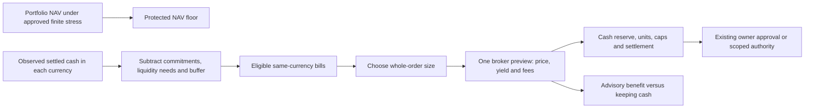

# Cash-sweep order controls

Owner decisions: 2026-10-01, simplified on 2026-10-02. Source implementation; activation and live route
commissioning are separate. The original [cash-sweep record](cash-sweep.md)
retains earlier assumptions and installed evidence. This record supersedes its
weekday-session fallback, gross-sale sizing and principal-only fee limitations.
The 2026-10-02 decision supersedes the earlier EUR 25 hard purchase-gain gate:
purchase value is advice, and a reviewed quantity is never resized for fees.

## Two independent checks



Buying a bill exchanges cash for an asset; it does not segregate the protected
NAV floor. Stressed NAV loss and cash funding needs are different quantities.
Assignment, margin, gaps, exit timing and settlement can create funding needs
that differ from marked losses. Liquidation cannot guarantee a floor.

The finite portfolio scenario, exit horizon, volatility/rate shocks and
per-currency allocation of the proposed buffer remain uncalibrated. This change
adds no portfolio stress-floor engine and does not imply those inputs are ready.
The current `keep_cash` remains an owner-set native-currency reserve. Do not
activate the broader reserve design before those choices and their evidence are
reviewed. `internal/risk` owns their eventual risk semantics.

EUR bills retain 28–182 days remaining; USD retains 28–91 days. Unexpected early
sales can lose money when rates or spreads move. The purchase comparison below
assumes holding a zero-coupon bill to maturity; it does not forecast an early
exit value.

## Whole orders and fees

| Control | Meaning | Missing evidence |
| --- | --- | --- |
| `min_order_notional` | Minimum complete order principal in account base currency, on both BUY and SELL. For the approved EUR-base profile: 10,000. | Zero preserves legacy native `min_tranche` until explicit owner migration. |
| `max_order_notional` | Maximum complete order principal in base; approved profile: 100,000. Fees consume cash separately. | An absent cap holds all sweeps. |
| `min_tranche` | Legacy native minimum, combined with the base minimum by taking the larger. | Invalid policy is refused. |
| Exact broker maximum commission | The behind-the-scenes cash reservation must be finite, consistent and match the cash currency. The ordinary broker estimate is shown for information. | An absent or contradictory exact bound still holds; an estimate cannot certify the reservation. |

The minimum is per order, not per broker lot. A small liquidity shortfall can
produce a larger top-up to meet that floor. Lot rounding and the actual reviewed
price still need to fit holdings and the cap. A capped sale may restore only
part of a larger shortfall; it must still meet the principal minimum. An inadequate
holding or incompatible grid holds rather than selling a tiny residual.

Sizing chooses one sensible whole-order quantity from cash, lots and the owner
bounds, then requests one WhatIf for that quantity. Fees do not trigger repeated
previews or automatic resizing. The actual previewed principal plus reserved
fees must fit cash; a failed cash or whole-order check holds that fixed quantity.
Signed/prepared orders retain their exact draft. An automatic order cannot
exceed the quantity in its existing notice. A different size needs new terms
and the existing authority path.
Known pending bill-sale proceeds hold new purchases until settlement, preventing
an immediate reversal of a liquidity top-up.

A Canary BUY's accepted maximum-fee reservation is persisted atomically with its exact place
or modify attempt before transmission. A current DAY working order can reuse it
only with matching endpoint, account/mode, broker/client identity, contract,
quantity, fixed limit, currency, route and execution terms, on the same UTC date.
The full fee reservation is kept after partial fills. A changed or unbounded newer
modify never falls back to an older bound. An unused preview cannot certify a
working order. An unmatched local BUY intent holds despite an empty cached
broker inventory. Restart restores the SQLite evidence; unavailable storage holds.

External/legacy orders, GTC orders and queued BUYs without an exact durable bound
still hold sweeps. The current queue supports reductions, not opening BUYs;
this change does not add BUY queue authority. No principal-only estimate becomes
a known fee-inclusive commitment. Final paid commissions and broker statements
remain distinct from this conservative reservation.

## Purchase value

`min_net_gain` remains accepted for policy-file compatibility as an advisory
benchmark in base currency. It never blocks or resizes a purchase. The earlier
EUR 25 hard-gate decision was replaced by the owner's 2026-10-02 simplification;
this source change adds no numeric benchmark and changes no private policy.
Liquidity sales subtract the exact reserved fee when estimating restored cash.
An otherwise valid sale can restore only part of the shortfall without a
fee-driven resize or hold; its remaining gap stays visible. Estimated or
pending proceeds cannot clear the gap before actual settlement.

```text
incremental gain = par redemption
                 − conservative entry at max(reviewed limit, live ask)
                 − exact broker maximum-fee reservation
                 − cash interest forgone on all-in cost
```

The ask includes entry spread, so it is not subtracted a second time. Risk's
pure calculation uses continuous compounding of the stated annual nominal upper
rate to conservatively cover cash-interest reinvestment. The result is advice,
not a forecast or an eligibility gate.

Each currency can supply an owner-reviewed `cash_interest_rate_upper` (annual
decimal) and `cash_interest_valid_through`. With current inputs the benefit is
known; absent or invalid calculation inputs make it unknown, and expired
interest assumptions make it stale. These states never hold the order. Missing
interest is not zero: zero must be explicit. This is a
conservative opportunity-cost assumption, not a live IBKR interest-rate feed or
a prediction of future rates. Review changes in published broker rates, account
terms and the intended holding period; do not insert a guessed zero to make the
advice look known. Below-benchmark or negative benefits remain visible warnings.

## Verified hours and settlement calendars

Only broker liquid/trading hours supply bill-session authority. Missing,
malformed or exhausted hours report unknown and refuse preview; historical
`assumed` session labels remain readable but cannot authorize a new order.

Payment dates use separate calendars with bounded 2026–2028 coverage:

- USD Federal Reserve payment holidays, including Columbus Day and Veterans Day;
  Saturday holidays leave the preceding Friday open. Source:
  [Federal Reserve Financial Services](https://www.frbservices.org/about/holiday-schedules/).
- EUR TARGET closing days, including Good Friday, Easter Monday and 1 May.
  Source: [ECB published calendar](https://www.ecb.europa.eu/ecb/contacts/working-hours/html/index.en.html).

A calendar does not prove a security's settlement cycle. Each currency must
commission `settlement_exchange`, `settlement_days` and
`settlement_valid_through` for its exact broker bill route. Missing, expired,
route-mismatched or out-of-coverage evidence holds. Unsupported GBP/CAD payment
routes hold too; their existing instrument vocabulary is not commissioning.
A trade date is read in the payment jurisdiction's timezone. A bill that matures
by the verified sale-settlement date is retained for its payout.

Dates are planning checks, not account settlement evidence. Broker-observed
settled cash is still required; these calendars cannot promote the diagnostic
Flex projection or journal estimates into spend authority.

## Product and activation boundaries

Delayed Nasdaq-100 data is supported for labelled background context without a
live subscription requirement. Required fresh calculation inputs and execution
quotes retain their own gates; see [market-data quality](../../docs/docs/understand/market-data.md).
No entitlement is fabricated or stored.

Tax review remains advisory and unset until actually completed. ETF fallback
remains inactive: a failed bill search keeps cash and retries later. This change
builds neither ETF execution nor a new tax gate.

Existing policy files and runtime settings are not edited by installing source.
The commented template illustrates the new controls, with expired example dates
that cannot commission a route or attest a cash-interest rate. Owner migration
must use the normal policy version/fingerprint checks. The new order-event fee
fields are additive; older daemons cannot reuse them to certify fee-inclusive
commitments. Broker-write confirmations, freezes and account pins remain binding.

## Validation

Synthetic regressions cover whole-order FX/rounding, fixed-quantity previewing,
net sale fees, advisory gain versus cash interest/spread, known/unknown/stale
advice and exact-zero versus unknown rates, payment
holidays and coverage boundaries, SQLite restart with partial fills, modified
and stale bounds, and unacknowledged local BUYs. Both daemon build modes retain
the prepared-order, automatic-notice and maximum-notional safety tests. These
prove software contracts; live cash/contract/settlement commissioning is separate.
