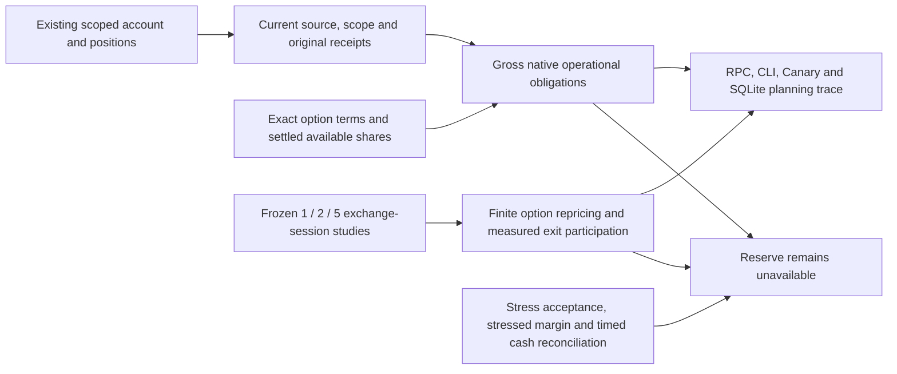
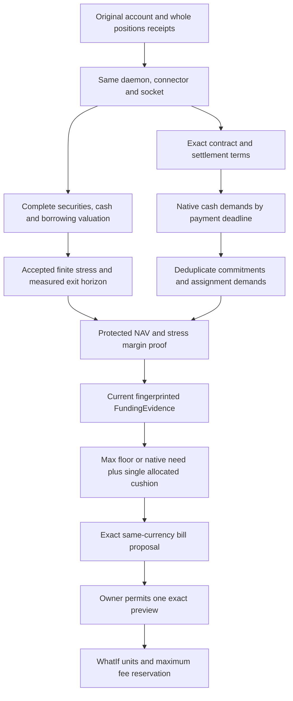

# Operational funding observation and finite calibration

Source increment, 2026-10-02. This extends the [priority/log increment](cash-sweep-priority.md);
it does not activate a policy or commission a reserve. `FundingEvidence` remains
nil in production. There is no new broker request, FX conversion, rate default,
private-policy edit, margin exception or order authority.

## Current observation

Consume the already-read account/positions results only after matching concrete
account/mode, closed source vocabulary, available/current authority, original
receipt clocks and the engine's current scope. Recheck freshness at consumption
using existing 15-second account and five-minute portfolio receipt limits.
The public authority contract retains each original read's daemon start,
published connector generation and physical socket epoch. Account reads use
the account snapshot's original binding; positions use the reader's original
binding. All three values must match one another and the current connector.
Missing or different receipts retain a named gap; the sampled planning epoch
does not certify preceding reads. Filtered position views are explicitly not
whole-portfolio funding input.

Short stock cover uses the current explicit live quote and existing approved
takeover-gap scenario. Its borrow-recall deadline remains unknown. Short puts
show nominal strike principal as **indicative**, while verified gross assignment
needs require exact ConID/currency/right/expiry/strike/multiplier, dated simple
share-delivery terms, aggregate exercise cash and an earliest settlement date.
Exercise cash must equal strike × multiplier; cash-settled, multi-asset and
fractional deliverables are unsupported and remain unavailable.

A multiplier does not prove delivery of 100 shares. Corporate actions can
change delivery; physical equity assignment settles on T+1, but contract and
route-specific deadlines cannot be inferred from that general rule.
Sources: [OCC equity product specifications](https://www.theocc.com/clearance-and-settlement/clearing/equity-options-product-specifications),
[OCC special settlements](https://www.theocc.com/market-data/market-data-reports/series-and-trading-data/equity-special-settlements).

Covered calls consume exact same-currency settled, unpledged, unreserved shares
once across all calls. A held stock quantity alone grants no coverage credit.
The live partial observer now explicitly uses `uncredited_conservative`:
reserve cash to cover every deliverable share, without crediting even a known
settled holding. Each call names that coverage treatment and leaves
`covered_shares` absent; unavailable coverage is not emitted as observed zero.
This removes a settled-share-proof dependency from that conservative bound.
Exact deliverables, the underlying quote and the earliest cash deadline remain
required. Verified-credit experiments retain their once-only share allocation.
Uncovered shares require the exact underlying identity and explicit quote;
cover cost is gross, without crediting prospective exercise proceeds. Long
options retain an automatic-exercise-policy gap: calls can require strike
funding and puts can require delivery. Protective options grant no automatic-exercise credit. Unknown terms, stale
metadata, nonfinite arithmetic and duplicated identities cannot certify zero.

Gross obligations are not net additional funding: working commitments need
exact contract-level overlap reconciliation before admission. Known components
and complete currency totals are separate; absent totals remain unavailable.
UI and CLI show partial observations and the trace preserves original clocks.
Unchanged observation-clock refreshes do not rewrite prior decision receipts.

## Finite studies

The pure risk engine consumes frozen exact exchange-session end dates and
studies 1, 2 and 5 sessions. Existing Rulebook cluster-drop, takeover-gap and exit
participation numbers are read without alteration. Applying the downward move
simultaneously across this study's book is an explicit study hypothesis, not
an owner-approved replacement for declared cluster membership.

Stocks are repriced directly; exact vanilla options use a bounded 128-step CRR
tree supporting European and American exercise. Volatility, current rate,
dividend yield, volatility shock, rate shock and adverse FX assumptions must be
explicit. No VIX shock is silently promoted to an option-IV shock. Unsupported
bonds/derivatives remain unpriced; bills still require dated curve/rate-stress
and exact maturity/early-exit evidence. Quote/exit source clocks stay original.

Total-NAV studies also require the complete native trade-date cash ledger and
its original account receipt. The account authority retains the broker's full
currency count before display projections can omit an FX-unknown row. Missing,
duplicate, unobserved or nonfinite cash rows withhold NAV totals. Valuation
uses original account balances, including native borrowing; the lower spending
balance across broker channels is not a valid whole-account FX valuation.
Under the explicitly supplied FX shock, both positive foreign cash and foreign
borrowing contribute adverse FX loss. As with security FX, this is a conservative
component-wise envelope with no cross-asset hedge credit. It does not invent a
shock or convert cash and remains separate from settled-cash admission.

Live numeric studies additionally require explicit source validity. Cash uses
its original account receipt plus the existing 15-second account freshness
window. Each price and exit envelope has its own original observation and
source-supplied expiry. A separate NAV/FX valuation bundle expires at the
earliest original NAV or FX source expiry. Missing, future, reversed, expired
or boundary-equal validity withholds all numeric loss/NAV totals. The observer
does not attach account freshness to unrelated quote, volume, fee or FX data.
Historic ADV windows may remain usable when their evidence owner explicitly
supplies current validity; their old window date alone does not make them stale.
Frozen synthetic studies retain their locked historical-clock semantics.
Current live quote/exit/FX contracts do not yet expose all those expiry proofs,
so their omissions remain explicit commissioning gaps rather than refreshed
planner timestamps.

Exit completion uses verified 20-day volume in exact position units and the
existing participation policy. Explicit maximum spread and fee evidence supply
friction. This is conditional capacity, not a promised execution or cash receipt.
An incomplete exit never becomes settled proceeds. The model has no calibrated
broker margin or timing reconciliation; even `study_complete` retains those
gaps and cannot create `NAVFloorPassed` or `MarginPassed`.

Frozen fixtures are synthetic. They freeze the compiled Rulebook baseline's
30% cluster drop, 100% takeover gap and 20% exit participation with its exact
policy fingerprint. They contain a EUR stock position and a USD
short American put, synthetic NAV 250,000 and protected floor 200,000. The
following sensitivities are **experiments, not policy recommendations/defaults**:

| Frozen assumptions | Sessions | Worst loss EUR | NAV after EUR | Exit complete |
| --- | ---: | ---: | ---: | --- |
| A: +10 IV points, +100 bp rate, 5% adverse FX | 1 | 14,022.61 | 235,977.39 | No |
| A | 2 | 14,022.61 | 235,977.39 | No |
| A | 5 | 14,022.61 | 235,977.39 | Yes |
| B: +20 IV points, +200 bp rate, 10% adverse FX | 1 | 14,719.26 | 235,280.74 | No |
| B | 2 | 14,718.11 | 235,281.89 | No |
| B | 5 | 14,715.70 | 235,284.30 | Yes |

Reproduce with `go test ./internal/risk -run CashSweepFrozen -count=1 -v`.
The European ATM zero-rate call independently matches its analytic value to
0.03; an American put test verifies early-exercise value. Missing dates, prices,
FX, volume, fees or exact option inputs return nil totals. Duplicate ConIDs
cannot offset one holding against itself.

## Next admission work and owner boundary

| Required fact | Source/work we own | Owner choice |
| --- | --- | --- |
| Native settled cash | Separately scoped TWS probe/reader; retain its admission holds | None |
| Exact deliverable, exercise style and settlement | Match broker contract identity to issuer/OCC specification; handle adjustments and source expiry | None |
| Settled available shares and pending assignment/exercise | Broker activity/settlement observations, reservations and exact reconciliation | None |
| Current rate/dividend/FX/option inputs | Authoritative dated market/issuer sources and original source clocks | None |
| Measured exit capacity/spread/fees | Verified exact-unit volume window, executable quote envelope and fee bounds | None |
| Stressed margin | Native-currency portfolio margin stress evidence/model calibration; current/look-ahead margin alone is insufficient | None to fabricate a pass |
| Accepted stress envelope and exit horizon | Calibrate actual source coverage and frozen adversarial scenarios, present tradeoffs | One narrow acceptance decision if existing approved policy cannot supply it |

After actual sources are wired, compare the candidate horizons and shock envelope
against the real book in shadow. A longer horizon allows more measured exit
capacity but keeps funding exposed longer; a stronger envelope retains more
cash. Request the owner's acceptance of a concrete reviewed envelope only when
that choice is needed. Missing market facts are our implementation work, not a
request for the owner to guess or provide screenshots.

## Production commissioning sequence

The next producer should consume a frozen bundle, rather than infer approval
from a completed study. Its binding includes original session tuple, account
scope, full portfolio identity/generation, current policy fingerprint, terms
and source clocks. Expiry is the earliest expiration of any admitted input.
Payment-deadline demands are computed in each native currency; broker-confirmed
settled cash funds them. Future bill sales, protective-option exercise, borrowing
and FX conversions do not create funding credit. Existing working buys overlap
only when exact obligation identity proves the same demand; otherwise reserve
both. Optional settled-share coverage may reduce call funding only on exact
settled/unreserved proof; a conservative no-coverage study should show the full
cash cost, rather than wait for the owner to guess share settlement.

The remaining live-input work belongs to the implementation: exact option
deliverables/style/underlying and adjustment evidence, true assignment/exercise
cash deadlines, dated rates/dividends/FX, exact-unit volume and executable
spread envelopes, bill curve/rate-shock valuation, and pending commitments.
Read-only existing broker and official issuer/OCC sources should be used first.
TWS ContractDetails' underlying ID is not sufficient proof of an adjusted
option's deliverable; official [OCC adjustment notices](https://infomemo.theocc.com/infomemo/search)
are a separate source. [OCC's T+1 conversion notice](https://infomemo.theocc.com/infomemos?number=54580)
establishes the general equity settlement cycle, not the exact pending account
obligation or availability of held shares.

Two earlier assumptions need review before they become permanent requirements:

- A broker-generated stress-margin number is not the only defensible design.
  A documented conservative margin model, checked against actual broker
  observations and existing house requirements, can supply bounded evidence.
  Current account/look-ahead margin or one ordinary order WhatIf alone cannot
  certify that bound. IBKR's published
  [margin requirements](https://portal.interactivebrokers.com/en/trading/margin-requirements.php)
  depend on residence, venue and product and may include house requirements.
  Its [risk-report guide](https://www.ibkrguides.com/orgportal/contact-other-reports.htm)
  describes stress reports as P/L changes, so a P/L report must not be relabeled
  as stress-margin evidence.
- Not every missing source must block every conservative study. Settled shares
  can receive no coverage credit; long options can receive no automatic
  protective exercise credit. Such bounds need explicit semantics and verified
  contract terms, not a fabricated zero observation. A model must still include
  the gross funding obligation and its earliest deadline.

The no-covered-share-credit operational mode is implemented as partial evidence;
the eventual calibrated producer and any policy activation remain open. It
does not create `FundingEvidence`, certify margin or make a bill tradeable.

No new owner thresholds are needed to implement those readers. If the existing
Rulebook cannot specify an accepted shock envelope and horizon, present one
concrete calibrated choice after source coverage is measured. Do not request a
generic permission to activate an uncommissioned reserve.

## Exact bill-route evidence

| Evidence | Read-only work we own | Exact owner step |
| --- | --- | --- |
| Issuer, currency, maturity and contract identity | Official issue calendar/list plus native contract resolution; held bills retain broker maturity source | None |
| Tick, minimum and size increment | Current exact broker contract details; conventions remain assumptions until checked | None |
| Session and quote | Broker contract liquid/trading hours and a live bid/ask with original clocks | None |
| Settlement lag and payment calendar | Public market convention plus matching broker route evidence; reuse exact historical confirmed fills/settlement if retained; no weekday inference | Review dated route only if broker evidence cannot establish it |
| Exact quantity unit and commission | Choose one sensible whole quantity, freeze currency/ConID/route/side/quantity/limit/LMT/DAY, then one WhatIf | Explicit current-turn permission for that exact preview; no submit |
| Cash reservation | Principal plus finite exact same-currency broker maximum commission; estimate remains informational | None to alter fees or resize automatically |
| First purchase | All existing account, freeze, pin, policy, journal and fresh authorization gates remain in force | Separate transaction-specific purchase approval |

USD `face_1000` and EUR `face_1` are current conventions, not guarantees from
an instrument's identifier. A read-only lot check can refute them; it cannot
replace the exact preview's broker margin/unit witness. A fee witness is tied
to the exact current terms, not a permanent currency-wide commission number.
Broker/public facts should be collected before asking for the narrow preview;
no new login, repeated screenshots or fee threshold decisions are required by
this engineering sequence.
