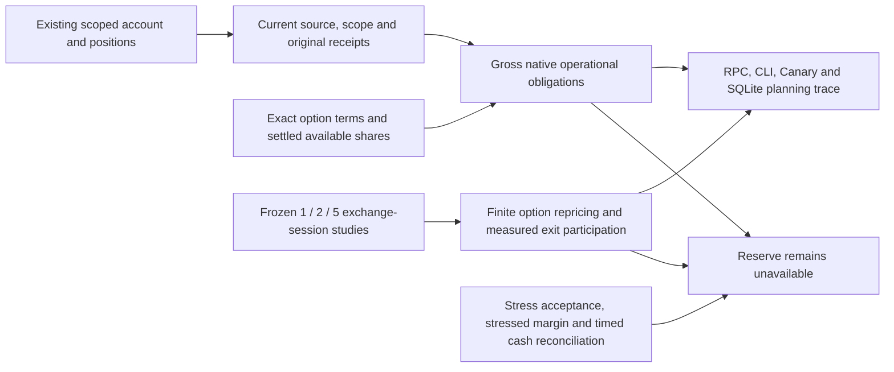

# Operational funding observation and finite calibration

Source increment, 2026-10-02. This extends the [priority/log increment](cash-sweep-priority.md);
it does not activate a policy or commission a reserve. `FundingEvidence` remains
nil in production. There is no new broker request, FX conversion, rate default,
private-policy edit, margin exception or order authority.

## Current observation

Consume the already-read account/positions results only after matching concrete
account/mode, closed source vocabulary, available/current authority, original
receipt clocks and the engine's current scope. Recheck freshness at consumption
using existing 15-second account and five-minute portfolio receipt limits.
The public authority contract has no common original connector epoch; that gap
is named. The sampled planning epoch does not certify preceding reads.

Short stock cover uses the current explicit live quote and existing approved
takeover-gap scenario. Its borrow-recall deadline remains unknown. Short puts
show nominal strike principal as **indicative**, while verified gross assignment
needs require exact ConID/currency/right/expiry/strike/multiplier, dated simple
share-delivery terms, aggregate exercise cash and an earliest settlement date.
Exercise cash must equal strike × multiplier; cash-settled, multi-asset and
fractional deliverables are unsupported and remain unavailable.

A multiplier does not prove delivery of 100 shares. Corporate actions can
change delivery; physical equity assignment settles on T+1, but contract and
route-specific deadlines cannot be inferred from that general rule.
Sources: [OCC equity product specifications](https://www.theocc.com/clearance-and-settlement/clearing/equity-options-product-specifications),
[OCC special settlements](https://www.theocc.com/market-data/market-data-reports/series-and-trading-data/equity-special-settlements).

Covered calls consume exact same-currency settled, unpledged, unreserved shares
once across all calls. A held stock quantity alone grants no coverage credit.
Uncovered shares require the exact underlying identity and explicit quote;
cover cost is gross, without crediting prospective exercise proceeds. Long
options retain an automatic-exercise-policy gap: calls can require strike
funding and puts can require delivery. Protective options grant no automatic-exercise credit. Unknown terms, stale
metadata, nonfinite arithmetic and duplicated identities cannot certify zero.

Gross obligations are not net additional funding: working commitments need
exact contract-level overlap reconciliation before admission. Known components
and complete currency totals are separate; absent totals remain unavailable.
UI and CLI show partial observations and the trace preserves original clocks.
Unchanged observation-clock refreshes do not rewrite prior decision receipts.

## Finite studies

The pure risk engine consumes frozen exact exchange-session end dates and
studies 1, 2 and 5 sessions. Existing Rulebook cluster-drop, takeover-gap and exit
participation numbers are read without alteration. Applying the downward move
simultaneously across this study's book is an explicit study hypothesis, not
an owner-approved replacement for declared cluster membership.

Stocks are repriced directly; exact vanilla options use a bounded 128-step CRR
tree supporting European and American exercise. Volatility, current rate,
dividend yield, volatility shock, rate shock and adverse FX assumptions must be
explicit. No VIX shock is silently promoted to an option-IV shock. Unsupported
bonds/derivatives remain unpriced; bills still require dated curve/rate-stress
and exact maturity/early-exit evidence. Quote/exit source clocks stay original.

Exit completion uses verified 20-day volume in exact position units and the
existing participation policy. Explicit maximum spread and fee evidence supply
friction. This is conditional capacity, not a promised execution or cash receipt.
An incomplete exit never becomes settled proceeds. The model has no calibrated
broker margin or timing reconciliation; even `study_complete` retains those
gaps and cannot create `NAVFloorPassed` or `MarginPassed`.

Frozen fixtures are synthetic. They freeze the compiled Rulebook baseline's
30% cluster drop, 100% takeover gap and 20% exit participation with its exact
policy fingerprint. They contain a EUR stock position and a USD
short American put, synthetic NAV 250,000 and protected floor 200,000. The
following sensitivities are **experiments, not policy recommendations/defaults**:

| Frozen assumptions | Sessions | Worst loss EUR | NAV after EUR | Exit complete |
| --- | ---: | ---: | ---: | --- |
| A: +10 IV points, +100 bp rate, 5% adverse FX | 1 | 14,022.61 | 235,977.39 | No |
| A | 2 | 14,022.61 | 235,977.39 | No |
| A | 5 | 14,022.61 | 235,977.39 | Yes |
| B: +20 IV points, +200 bp rate, 10% adverse FX | 1 | 14,719.26 | 235,280.74 | No |
| B | 2 | 14,718.11 | 235,281.89 | No |
| B | 5 | 14,715.70 | 235,284.30 | Yes |

Reproduce with `go test ./internal/risk -run CashSweepFrozen -count=1 -v`.
The European ATM zero-rate call independently matches its analytic value to
0.03; an American put test verifies early-exercise value. Missing dates, prices,
FX, volume, fees or exact option inputs return nil totals. Duplicate ConIDs
cannot offset one holding against itself.

## Next admission work and owner boundary

| Required fact | Source/work we own | Owner choice |
| --- | --- | --- |
| Native settled cash | Separately scoped TWS probe/reader; retain its admission holds | None |
| Exact deliverable, exercise style and settlement | Match broker contract identity to issuer/OCC specification; handle adjustments and source expiry | None |
| Settled available shares and pending assignment/exercise | Broker activity/settlement observations, reservations and exact reconciliation | None |
| Current rate/dividend/FX/option inputs | Authoritative dated market/issuer sources and original source clocks | None |
| Measured exit capacity/spread/fees | Verified exact-unit volume window, executable quote envelope and fee bounds | None |
| Stressed margin | Native-currency portfolio margin stress evidence/model calibration; current/look-ahead margin alone is insufficient | None to fabricate a pass |
| Accepted stress envelope and exit horizon | Calibrate actual source coverage and frozen adversarial scenarios, present tradeoffs | One narrow acceptance decision if existing approved policy cannot supply it |

After actual sources are wired, compare the candidate horizons and shock envelope
against the real book in shadow. A longer horizon allows more measured exit
capacity but keeps funding exposed longer; a stronger envelope retains more
cash. Request the owner's acceptance of a concrete reviewed envelope only when
that choice is needed. Missing market facts are our implementation work, not a
request for the owner to guess or provide screenshots.
