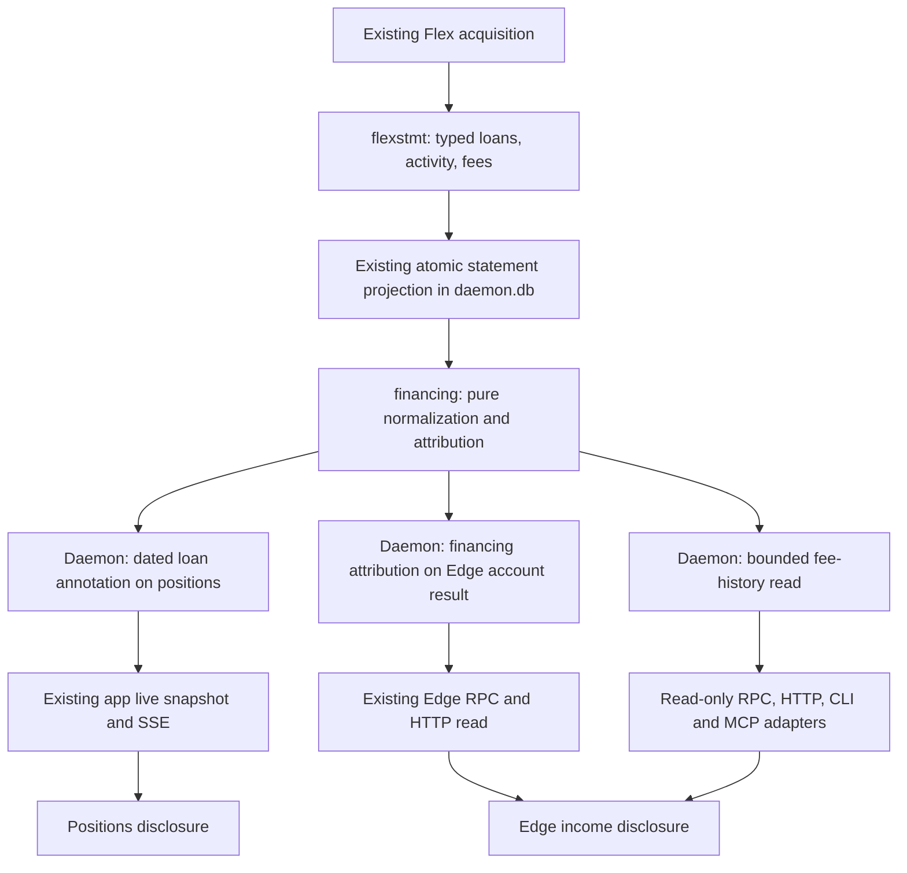

# Securities lending: UX and implementation plan

Status: implemented first slice, 2 October 2026. Read-only reporting; broker
commissioning remains open. All examples below are synthetic.

## Product contract

Show broker-reported lending in existing Positions and Edge account P/L. There
are no Canary participation modes, enrollment controls, new trading actions or
new tab. IBKR manages participation and loans. Borrow-cost attribution can reuse
the foundation later; the first slice is managed lending and earned fees.

| Surface | Behavior |
| --- | --- |
| Positions | A positive loan balance adds `Lent 60 · 1 Oct` to the stock detail line. No loan badge on options or verified zero balances. |
| Position expansion | Show reported quantity, statement date, net customer rate and collateral in native currency; link to that exact contract's fee history. |
| Edge account P/L | Add one expandable `Lending income earned` row for the account result's actual equity boundaries. Use account base currency when conversion is proved; otherwise retain native fees. P/L inclusion remains unproved. |
| Fee expansion | Latest first: earning date, security, shares lent, customer net fee and native currency. Per-row expansion contains rate, collateral and conversion evidence. |
| Empty book | Keep the existing empty Positions view. Historical fees remain accessible through Edge even after a position closes. |

Use current Canary typography, financial colors and disclosure behavior. Preserve
expanded rows, focus and reading position across refreshes. Apply existing money
privacy masking to summaries and expanded details. At phone widths, stack fee
metadata under security/date; do not compress a desktop table into tiny text.

Loan reports are dated observations. Join by the same resolved account, account
mode and exact ConID, never symbol alone. Do not divide yesterday's loan quantity
by today's holding: a `60 of 100` fraction requires matching statement-date owned
quantity. A sale or account/session mismatch withholds a current association;
the dated loan and fee history remain available. Never clamp a mismatched loan.

| Evidence | Presentation |
| --- | --- |
| Verified empty sections, complete relevant range | No loan badge; income `0.00` with a quiet empty history. This does not prove non-enrollment. |
| Missing sections or unproved query capability | `Lending data unavailable`; income unavailable rather than zero. One coverage notice, not a warning repeated on every position. |
| Incomplete fee range | `Known lending income` and a partial-coverage qualifier; retain valid rows, withhold the complete total. |
| Outdated loan snapshot | `Last reported lent 60 · 28 Sep`; historical fees do not expire merely because they are old. Reuse reporting due/freshness semantics. |
| Missing currency conversion | Keep native fees; base attribution unavailable. |
| Equity/accrual attribution unproved | Retain earned fees with `P/L reconciliation unavailable`; withhold the included-in-P/L claim. |
| Cash-credit linkage missing | Show earned fees with `Payment status unproved`. Cash-credit matching and paid/unpaid claims are deferred. |

## Evidence and assumptions

IBKR documents [loan balances](https://www.ibkrguides.com/reportingreference/reportguide/securities%20borrowedlentfq.htm),
[loan activity](https://www.ibkrguides.com/reportingreference/reportguide/securities%20borrowedlent%20activityfq.htm),
and [fee details](https://www.ibkrguides.com/reportingreference/reportguide/securities%20borrowedlent%20fee%20detailsfq.htm)
in its Activity Flex reporting. The references include `ManagedLoan`, exact
contract identity, currency, quantity, collateral and customer net fees. Their
descriptions also mention Portfolio Margin. Direct inspection of the Activity
Flex editor on 2 October 2026 confirmed the Portal labels **Securities
Borrowed/Lent**, **Securities Borrowed/Lent Activity** and **Securities
Borrowed/Lent Fee Details**, including the customer net fee and percentage-rate
controls. Populated XML mappings still need a representative broker sample.

Canary already reads `SLBOpenContracts` for FX/collateral reconciliation in
`internal/flexstmt/fx.go`. This proves an existing parser path, not a commissioned
managed-loan UX. Do not infer lending income from indicative short-borrow rates.

Synthetic baseline: one fictional account, EUR base currency; 100 SYNTH-LEND shares at a
statement anchor, 60 lent; USD 18,000 collateral; 4.2% net customer rate; two
broker fee rows of USD 2.10 each, on 30 Sep and 1 Oct 2026; USD-to-EUR rate 0.90;
earned USD 4.20 / EUR 3.78. Account P/L is EUR 1,500; fee inclusion remains unproved.
These quantities, rates, prices and income are not portfolio facts or forecasts.

Fixtures cover no shares/verified empty reporting, closed positions with
historical fees, missing sections, partial coverage, stale loans, missing or
wrong-target FX, restatements and repeated loan IDs across dates. Payment and
equity/accrual linkage remain explicitly unproved. Synthetic XML stays
provisional until broker schema is verified.

## Architecture and wiring

| Layer | Implemented change |
| --- | --- |
| `internal/flexstmt` | Add typed loan snapshots, activity and earned-fee records plus optional financing-section capability evidence. Normalize documented managed-loan signs; reject unsupported direction/units. Preserve unknown amounts. |
| `internal/daemon/daemon_statement_projection.go`, `corestore` | Projection v8 retains typed financing snapshots in the existing statement metadata and immutable metadata versions. No database migration or new table. Reparse retained sources and publish a coherent generation atomically. |
| New `internal/financing` | Small pure core: loan balances, dated net-fee totals, currency groups and period coverage. No I/O, policy, schedule or broker connection. Payment reconciliation is deferred. |
| `internal/daemon` | Compose against the current account and active Flex query generation. Reuse existing acquisition, retention and serialization. Add an optional dated lending field to `rpc.PositionView` and optional financing attribution beside `rpc.EdgeAccountResult`. |
| `internal/rpc`, Go clients | Add a bounded `financing.fees` read: actual period, optional exact-contract filter, opaque cursor, snapshot fingerprint; default 25, maximum 100 rows. Reject stale cursors/account changes. Monetary values are nullable with units and coverage. |
| App, CLI, MCP | Existing snapshot/SSE carries loan annotations; `/api/edge` carries attribution. Authenticated `GET /api/financing/fees`, matching client/CLI/read-only MCP adapter, tool budgets, validators and generated docs. Existing relay API forwarding already covers the authenticated route. Reads never contact Flex. |
| `web/app/underlyings.js`, `edge.js`, `index.html`, `styles.css` | Render annotations and disclosures from typed results. Load a bounded history page on expansion and reuse it for a position filter. Keep totals over the full covered period independent of pagination. |
| Desk | Add `canary_lending_fees` to the specialist's fixed read-only grant. The updated Canary binary must be installed first; an older tool catalogue fails clearly. No separate ledger or enrollment workflow. |

Financing coverage is optional and independent of existing Recon/Edge coverage.
Do not make missing lending sections invalidate working reporting. Reuse the
configured Flex query/token and candidate-validation workflow; query edits are
owner-operated and keep their existing generation boundary. Do not automatically
change the reporting configuration.

Private broker account/loan/transaction IDs stay inside retained evidence.
Public history uses opaque IDs and fingerprints; no raw XML, filenames, tokens
or broker free text. A loan transfer must not become a trade or affect Edge's
decision-price-impact metric.

## Accounting invariants

- Account P/L remains ending equity minus starting equity minus external flows.
  Attribution explains it; adding the financing row cannot change that total.
  Prove the same-period equity/accrual treatment before claiming fees are included.
- Include fee value dates after the opening equity boundary and through the
  closing boundary. Use the actual period, not an assumed calendar window.
- Use broker customer net fees, including signed corrections; never halve them
  again. Collateral and securities-return obligations are not income, new
  exposure or cash-sweep funding. Preserve the existing FX/collateral checks.
- Paid cash converts an accrual into cash. Match at the proven granularity
  (often account/currency/month), not an invented per-loan allocation. Only prove
  unpaid balances with opening accrual + earnings + adjustments - credits =
  closing accrual; period earnings minus period cash is insufficient.
- Keep substitute dividends separate from lending fees. Use statement conversion
  evidence, retain native values, and disclose any FX/reconciliation residual.

## Execution and test record

| Step | Implement | Acceptance / fail-fast witness |
| --- | --- | --- |
| 1. Contract | Verify documented fields and XML names; freeze synthetic fixtures and optional capability schema. | Managed-loan signs and customer net fees are covered by fixtures. A representative populated broker statement is still required to commission this mapping for the account/entity. |
| 2. Core and projection | Typed snapshots in projection v8 metadata, stable daily identities and pure aggregation. | Duplicate imports do not increase income; signed restatements replace prior rows; empty sections clear old rows. Missing amounts and invalid records cannot certify a complete total. |
| 3. Typed reads | Loan annotation, Edge attribution, bounded history and HTTP/CLI/MCP adapters. | Native/base sums and period boundaries match; missing FX/ranges stay unknown; P/L stays unchanged; exact-contract filters, stale cursors, account/mode/query changes and adapter parity are tested. |
| 4. UX | Inline Positions labels and Edge disclosure, phone layout, stable expansion and privacy masking. | Exercise all synthetic states at desktop/phone widths; keyboard expansion and focus retention; refresh does not reorder a focused list; empty live holdings retain historical fees; older clients tolerate absent optional fields. |
| 5. Gates and commissioning | Focused Go race tests; `make app-check`, affected render fixtures; `make test` and `make check` before implementation completion/commit. | Synthetic checks establish source behavior. First real lending report and later cash credit are a separate read-only commissioning witness; do not buy shares or enroll merely to test. |

Synthetic parser, projection, RPC, adapter and browser tests establish the
implemented source behavior, including empty, partial, stale and unavailable
states. Live loan/fee mapping, equity attribution and cash-credit reconciliation
remain separate commissioning work. Enrollment and broker writes are outside
this feature.

## Broad discovery ownership

The read-only `lending.screen` contract owns filters and ordering before limiting
results. Desk Discover, CLI and MCP share it. Fee/exclusion candidates cover the
whole usable US file; market context progressively fills through one background
worker shared with other research screens. Explicit covered/pending/unavailable
counts prevent an empty partially acquired screen from becoming a false negative.

Borrow-fee state version 4 adds bounded seven-date history to the same atomic
source document. Latest and minimum observed rates per source date preserve resets
without converting repeated polls into distinct dates. Versions 1–3 upgrade using
only their genuine last-good entry. Identity changes do not inherit persistence.
Completed-session market fields retain their source dates across disconnected
sessions; expired intraday quotes fall back to the valid completed close. A new
completed session invalidates yesterday's projection. Named reads remain available
for known lists and broker-provided evidence outside the bulk file.

### Persistence upgrade and rollback

Before installing the first version 4 writer, take a private SQLite-consistent
backup of `daemon.db`. Older binaries use strict decoding and cannot load the
new borrow-fee document; swapping only the executable is not a valid downgrade.
A downgrade needs a reviewed migration of this document back to version 3 while
preserving all other current authority, or normal recovery from the backup.
Restoring an older whole database after subsequent live activity also rewinds
other authority and must go through normal reconciliation; do not treat the
backup as an automatic rollback of a research-only change.
