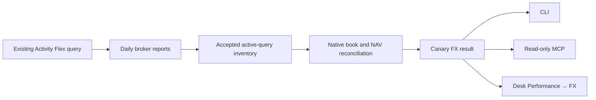

# FX contribution

`canary reporting fx` and the read-only `canary_reporting_fx` MCP tool serve
the same completed reporting-day contribution in the selected account's base
currency. Periods are Day, week-to-date, month-to-date and YTD; nothing is
annualised. This is valuation attribution, not realised currency tax-lot P&L.



## Evidence and acquisition

Enable these sections in the existing query: Net Asset Value Summary in Base
(daily totals and currency), Cash Report (all fields), Interest Accruals (all
fields), Open Positions at Summary detail (currency, report date, contract ID,
quantity, multiplier, mark price and native position value), Conversion Rates
(date, from/to currencies and rate), Trades at Execution detail (identifiers,
report date, asset category, symbol, native quantity/proceeds/price, taxes,
commission and commission currency), Cash Transactions (identity, report date,
type, native amount/currency and FX rate), Transfers and Corporate Actions.
Existing Recon/Edge query requirements still apply.

The daemon first fetches the full current-year NAV calendar with its prior-year
opening boundary, then one report per broker reporting date. It fetches recent
days first, shares the ordinary Flex request mutex and pauses ten seconds between
jobs. Daily acquisition resumes from accepted statements after restart. No new
credentials, query, trading connection or broker order is created. Files stay in
the private statement directory and the existing SQLite inventory.

```sh
canary reporting fx --backfill    # start/resume; returns progress immediately
canary reporting fx --json        # cached evidence, periods and dated gaps
```

Startup runs the background worker when Flex is enabled. After completing YTD,
it checks for new completed days once a minute. A transient fetch/acceptance error
retries after a minute. Invalid evidence is attempted once per worker run;
`--backfill` explicitly retries incomplete statements after a query correction.
The MCP tool cannot trigger acquisition. Concurrent local reads may briefly
report an inventory change while a new report is being accepted; they never
read unaccepted replacement bytes.

Only accepted files tagged for the active query and current account are used.
An attached XML report is useful for diagnosis; copying it into the directory
does not establish that authority. Newest daily broker generation wins;
conflicting equal generations fail closed. Both daily boundaries must match the
canonical NAV calendar. Restated NAV requires refreshed daily evidence.

## Calculation and reconciliation

For currency `c`, `B0/B1` are the opening/closing native book: trade-date cash,
marked investments and accrued interest. `x0/x1` convert one native unit to base.
`A` is actual currency-conversion principal in each leg, excluding commission.
`F` is external native capital, and `Fbase` its broker-reported base value.

```text
FX    = Σ B1 × (x1 − x0) + Σ (A + F) × x0 − Fbase
Other = Σ (B1 − B0 − A − F) × x0
NAV1 − NAV0 − Fbase = FX + Other
```

The closing-native convention allocates price and income interaction to FX.
There is no separate “Price × FX” line. Conversions use both actual principal
legs; execution-rate differences relative to the opening broker rate are included
in FX even on a day with unchanged closing rates. Explicit commissions enter
the native cash ledger once, outside conversion principal. Foreign income and fees
participate through their closing-value interaction. Residence is irrelevant.

Certification checks native position quantity × multiplier × price, each NAV
component, the full native book translated to NAV, the dated native cash ledger
(including cash-report sales tax), accrual movements, adjacent cash/accrual
continuity, required rates and the NAV bridge. The bridge residual certifies the
book identity; it does not independently prove conversion/flow classification.

Unknown cash types, transfers, corporate actions, unsupported/missing native
accrual components, inconsistent dates/units, account/model scope mismatches,
missing rates and mixed base currencies leave explicit gaps. They need a reviewed
event/native-value bridge before that period can be certified. Existing Recon
continues to process those events separately.

## Consumer contract

`canary-fx-v1` exposes ascending `days`, four `periods`, the shared `method`,
`base_currency`, last completed `through` and `backfill` progress. Money is absent
when unknown; an observed zero is present. Complete counts are required for
`available` and `no_exposure`. Partial periods show known daily effects but omit
the total; missing dates are explicit and must not be interpolated.

`no_exposure` requires complete evidence and no gross foreign exposure throughout
the period, including earlier holdings and intraday conversions. A hedged/net
zero currency book still has foreign exposure. Desk keeps the FX tab visible and
shows a hint for `no_exposure`. It displays no position/P&L tables and computes no
financial attribution; it only selects periods and draws Canary's daily values.

Tests use synthetic books and broker XML: conversions in both directions, flat
intraday conversions, external capital, fees, price/income interaction, missing
sections/rates/boundaries, restatements, coverage and gross exposure. Real account
statements and reconciliation outputs never enter Git.
